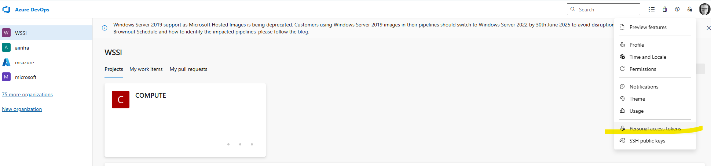
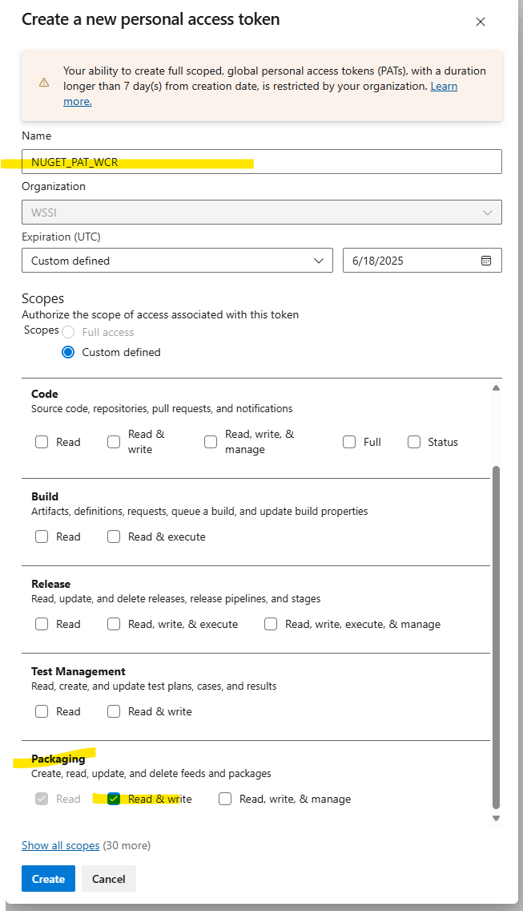
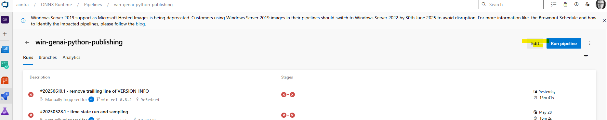
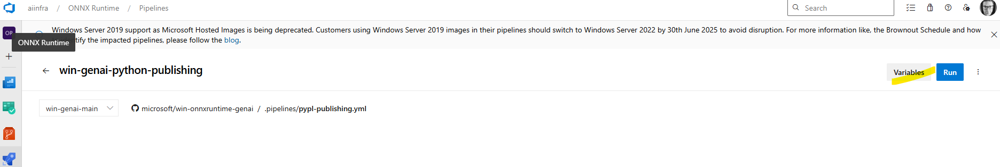
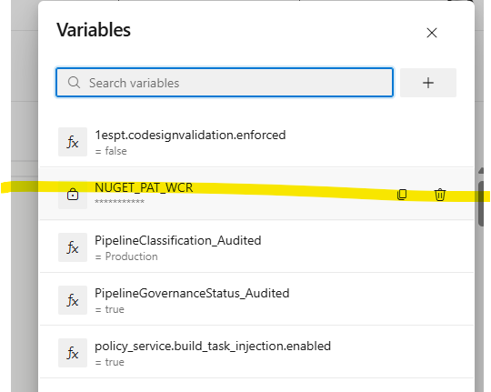
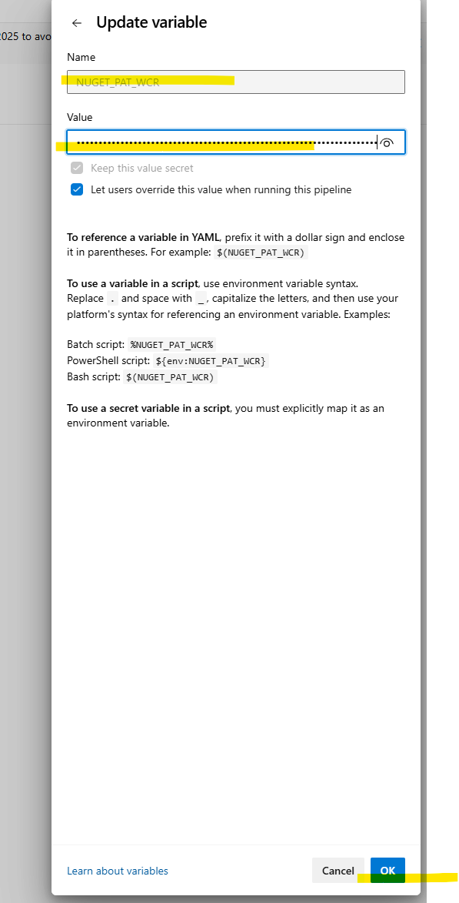

# README - WCR.GenAI

1. Find latest WCR nuget and build.
2. Find the ORT UPack that was used to build that.
3. Update the UPACK and NUGET versions in the cmake files.
  1. Go download and regiser the MSIX for WinWML and any EPs.
4. go-build-test-reldebug.cmd

`winget install LLVM.LLVM`

[1.22.25-202506132129](https://microsoft.visualstudio.com/ProjectOxford/_git/windows-ml?path=/tools/onnxruntime/OnnxRuntimeSDK.props&version=GBmain&line=6&lineEnd=6&lineStartColumn=6&lineEndColumn=31&lineStyle=plain&_a=contents)

## Build

```bash

cmake --preset windows_x64_cpu_release

cmake --build --preset windows_x64_cpu_release --parallel --target onnxruntime-genai

```

## NUGET

https://dev.azure.com/WSSI/COMPUTE/_artifacts/feed/WCR/NuGet/Microsoft.Windows.AI.MachineLearning/overview/0.3.134-beta

install_nuget_package(Microsoft.Windows.AI.MachineLearning

0.3.134-beta

## WCR Official Build 


https://dev.azure.com/WSSI/COMPUTE/_build/results?buildId=35116&view=results

WCR - c4fdce6c0a522b4ed82717f73476ffccd02c72dd

## Get WCR - ORT UPACK Version

```bash


C:\git\WCR>git show c4fdce6c0a522b4ed82717f73476ffccd02c72dd:dependencies/Ort/CMakeLists.txt | findstr VERSION
  VERSION 1.22.25-202505150620

```

ORT_UPACK=1.23.25-202508042339
az artifacts universal download --organization "https://dev.azure.com/WSSI/" --project "ba6740df-1998-4493-842b-c1830f6544e2" --scope project --feed "WCR" --name "win-onnxruntime-sdk" --version %ORT_UPACK% --path __ORT_ROOT

## Build Pipelines

- [win-genai-nuget-publishing](https://aiinfra.visualstudio.com/ONNX%20Runtime/_build?definitionId=1938)
- [win-genai-python-publishing](https://aiinfra.visualstudio.com/ONNX%20Runtime/_build?definitionId=1964)


### NUGET_PAT_WCR

The WSSI artifact feed is where all the WinML stuff lives. Sadly this is in another org and so we need a way to 'cross' the streams. Today we need to do this with a user PAT, which can only live for 7 days. 

Here are the steps to generate your own PAT and update the pipeline variables to unblock a build.

1. Navigate tohttps://dev.azure.com/WSSI/, click on the user menu (top right), and select Personal access key.
  

2. Create a token with Packaging - Read & Write permissions. `NUGET_PAT_WCR` is the recomended name, but is complety arbitrary. 
  

3. Navigate to one of the two pipeines, e.g. https://aiinfra.visualstudio.com/ONNX%20Runtime/_build?definitionId=1964, and select *edit*.
  

4. Select *variables*.
  

5. Select the `NUGET_PAT_WCR` variable
  

5. Update the value with your PAT, OK and save. 
  

Note: Some times it can take 30-45s to update the PAT, so a bit of patience is advised.

## ATTIC

## win-ort

[This syncs from GitHub win-onnxruntime to ADO win-onnxruntime](https://dev.azure.com/WSSI/COMPUTE/_build?definitionId=626)

[This builds ORT from the ADO](https://dev.azure.com/WSSI/COMPUTE/_build?definitionId=620)

[GenAI Nuget Pipeline](https://aiinfra.visualstudio.com/ONNX%20Runtime/_build?definitionId=1385)

## Build WCR.GenAI with win-ort

```bash

git checkout wcr-genai-main

go-prep-build.cmd

go-build-test-debug.cmd

go-example-phi3.cmd

```

## Remote House keeping

`origin/main` and `up/main` are the 'same'.
`wcr-genai-main` is this repos 'main' that will move back to up(stream) once we are ready to go.

### remotes

```bash
git remote -v
origin  https://github.com/chrisdMSFT/wcr.genai.git (fetch)
origin  https://github.com/chrisdMSFT/wcr.genai.git (push)
up      https://github.com/microsoft/onnxruntime-genai.git (fetch)
up      https://github.com/microsoft/onnxruntime-genai.git (push)
```

### Update main from up(stream) repo.

```bash
git checkout wcr-genai-main
git fetch --all
git merge origin/main
git push
```

## Test

python -m venv .python
call .python\Scripts\activate.cmd

OR

conda create --name genai python=3.13

python -m pip install -r test\python\requirements.txt --user
python -m pip install -r test\python\cpu\torch\requirements.txt --user
python -m pip install -r test\python\cpu\ort\requirements.txt --user
python -m pip install -r build\cpu\win-x64\wheel\onnxruntime_genai-0.7.0.dev0-cp313-cp313-win_amd64.whl --no-deps

### Build OG

```bash

cmake --preset windows_x64_cpu_release
cmake --build --preset windows_x64_cpu_release --parallel

copy build\cpu\win-x64\_deps\ortlib-src\runtimes\win-x64\native\ build\cpu\win-x64\Release
build\cpu\win-x64\Release\unit_tests.exe

```

## onnxruntime-extensions

https://github.com/microsoft/onnxruntime-extensions/commit/b8ae8719f4a924fc35867ef5a6e01ac0d8149a68


Gardian Supression for the zip file.

https://eng.ms/docs/products/onebranch/securitycompliancegovernanceandpolicies/sdlforcontainerizedworkflows/suppresssdlissues/showguardiansuppressions

