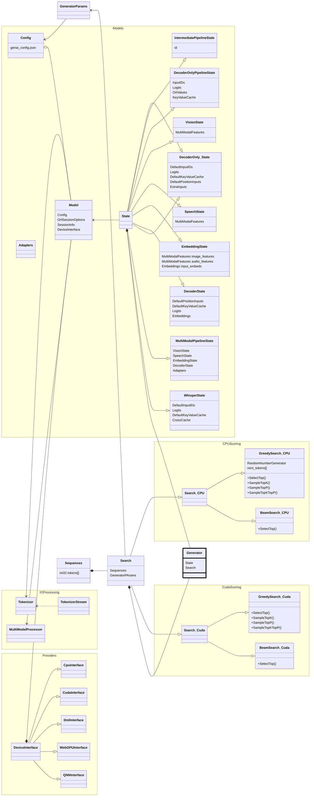
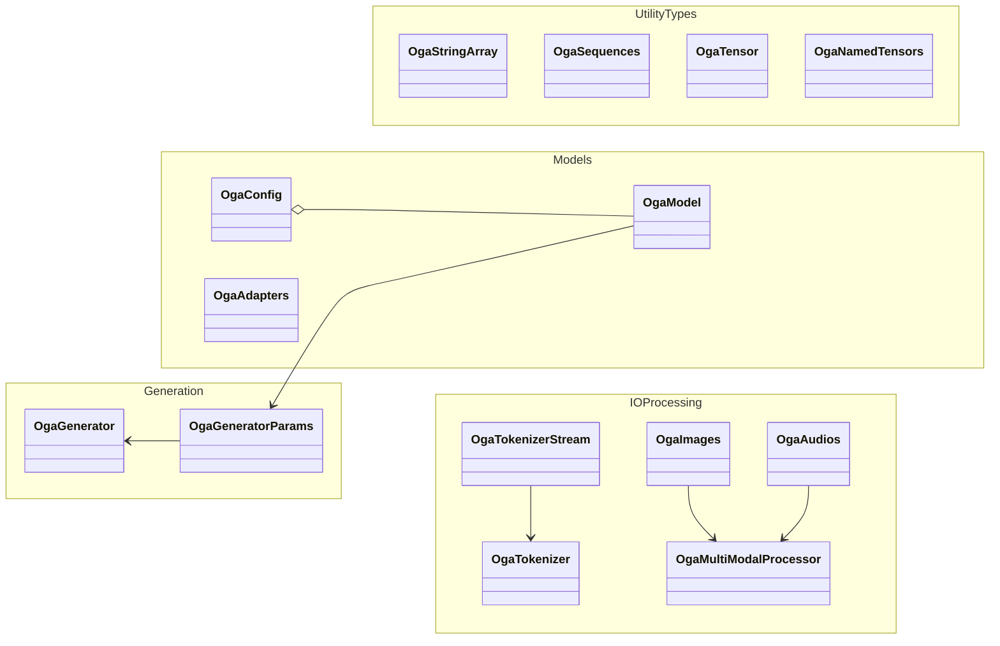

# GenAI architecture

GenAI is divided into a few main sections:

* Models - Manages the input/output OrtValues for an OrtSession for each model type supported
  * DecoderOnly
  * MultiModal
  * Pipelined
  * Whisper (in progress)
* Scoring - Takes the logits and figures out the next token
  * Greedy Search - TopK/TopP/Temperature
  * Beam Search
* IO Processing - Mostly implemented through onnxruntime-extensions
  * Tokenizing/Detokenizing
  * Audio & Image Encoding & Decoding
* Providers - Provider device specific code to handle device memory management & provider accelerated versions of scoring
  * CPU
  * Cuda - Accelerated scoring and model IO handling
  * Dml - Accelerated model IO handling
  * WebGPU - Device memory KV cache storage
  * QNN - Device memory allocation, but memory is CPU accessible
* Generator - Ties the model & scoring together and holds the runtime state

# C API Objects

# Device Memory Management

Example of how device memory is managed using the WebGPU provider.

* The CpuInterface implementation of the DeviceInterface (src/cpu/interface.cpp) takes an OrtAllocator, which is retrieved from the Onnxruntime API: Ort::Allocator::GetWithDefaultOptions()
* The WebGPU implementation of the DeviceInterface (src/webgpu/interface.cpp) also takes an OrtAllocator, which is retrieved from the first OrtSession with that device in src\model.cpp:EnsureDeviceOrtInit
   * Other non CPU providers work the same way

## Model class

Inside the Model class there is a 'DeviceInterface* p_device_' member, this represents the primary provider used to run the model (the primary one OnnxRuntime will be using). But the location of the OrtValue tensors passed for inputs/outputs don't always use this device. For WebGPU, the KV cache inputs/outputs are allocated through the WebGPU DeviceInterface & its allocator (p_device_kvcache_), but other model inputs use the CPU device & allocator (p_device_inputs_). These are decided in Model::InitDeviceAllocator per device.

The reason to allow different memory locations is primarily because there might be no device specific code to handle certain model inputs/outputs, and Onnxruntime will automatically transfer memory around as needed internally. As many of the GenAI inputs are small, the main performance boost is using the provider inside Onnxruntime vs GenAI.

The KV cache is a special case vs the other inputs as this is mostly handled by the model itself and is large, so it is easy and worth it to allocate on the device. Only BeamSearch scoring needs to manipulate this memory, GreedySearch does not access the memory.

## Scoring

Scoring is done entirely outside of onnxruntime, so it's not mandatory to involve Onnxruntime's allocators to manage the memory but our long term plan is to use OrtAllocator to do this. In src\search.h there is a cpu_device_ that uses the OrtAllcoator, but for cuda we still call cudaMalloc directly in many cases.
