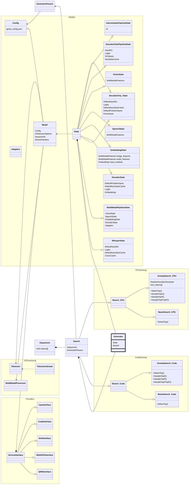
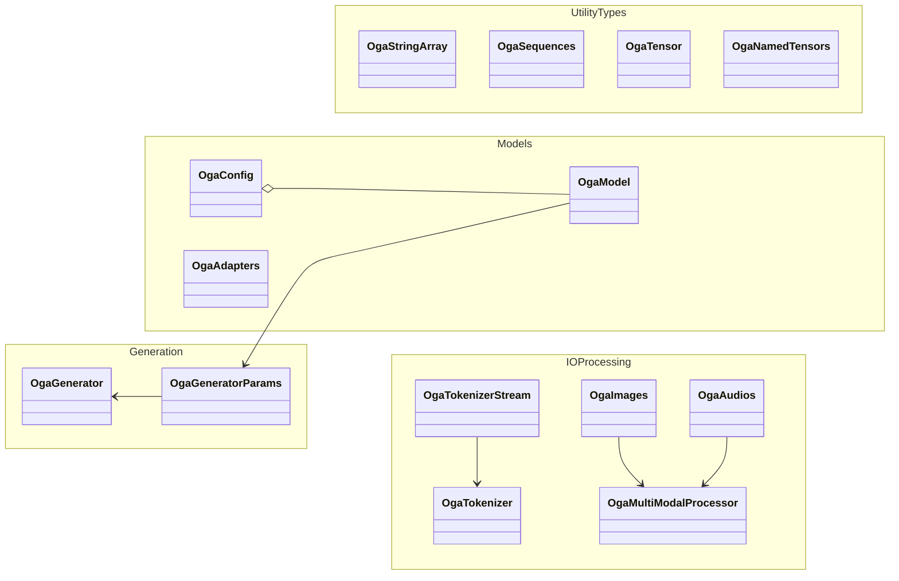

# GenAI architecture

GenAI is divided into a few main sections:

* Models - Manages the input/output OrtValues for an OrtSession for each model type supported
  * DecoderOnly
  * MultiModal
  * Pipelined
  * Whisper (in progress)
* Scoring - Takes the logits and figures out the next token
  * Greedy Search - TopK/TopP/Temperature
  * Beam Search
* IO Processing
  * Tokenizing/Detokenizing
  * Audio & Image Encoding & Decoding
* Providers - Provider device specific code to handle device memory management & provider accelerated versions of scoring
  * CPU
  * Cuda - Accelerated scoring and model IO handling
  * Dml - Accelerated model IO handling
  * WebGPU - Device memory KV cache storage
  * QNN - Device memory allocation, but memory is CPU accessible
* Generator - Ties the model & scoring together and holds the runtime state

# C API Objects

