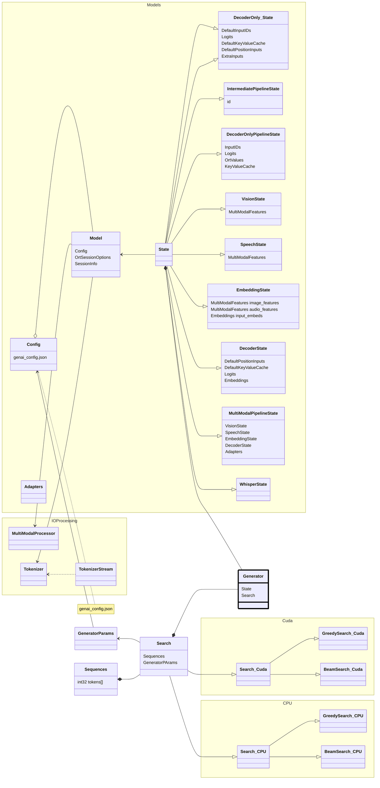
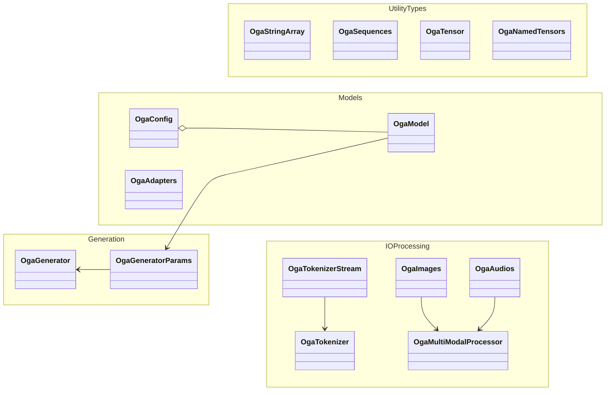

# GenAI architecture

```mermaid
classDiagram
  direction RL
  namespace Models {
    class Config{
      genai_config.json
    }
    class Model{
      Config
      OrtSessionOptions
      SessionInfo
    }
    class Adapters{
    }
    class State{
    }
    class DecoderOnly_State{
      DefaultInputIDs
      Logits
      DefaultKeyValueCache
      DefaultPositionInputs
      ExtraInputs
    }
    class IntermediatePipelineState{
      id
    }
    class DecoderOnlyPipelineState{
      InputIDs
      Logits
      OrtValues
      KeyValueCache
    }
    class VisionState{
      MultiModalFeatures
    }
    class SpeechState{
      MultiModalFeatures
    }
    class EmbeddingState{
      MultiModalFeatures image_features
      MultiModalFeatures audio_features
      Embeddings input_embeds
    }
    class DecoderState{
      DefaultPositionInputs
      DefaultKeyValueCache
      Logits
      Embeddings
    }
    class MultiModalPipelineState{
      VisionState
      SpeechState
      EmbeddingState
      DecoderState
      Adapters
    }
    class WhisperState{
    }
  }
  DecoderOnly_State <|-- State
  IntermediatePipelineState <|-- State
  DecoderOnlyPipelineState <|-- State
  VisionState <|-- State
  SpeechState <|-- State
  EmbeddingState <|-- State
  DecoderState <|-- State
  DecoderOnly_State <|-- State
  MultiModalPipelineState <|-- State
  WhisperState <|-- State
  namespace IO Processing {
    class Tokenizer{
    }
    class TokenizerStream{
    }
    class MultiModalProcessor{
    }
  }
  Model --> Tokenizer
  Model --> MultiModalProcessor
  TokenizerStream ..> Tokenizer
  note for Config "genai_config.json"
  namespace CPU {
    class Search_CPU{
    }
    class GreedySearch_CPU{
    }
    class BeamSearch_CPU{
    }
  }
  namespace Cuda {
    class Search_Cuda{
    }
    class GreedySearch_Cuda{
    }
    class BeamSearch_Cuda{
    }
  }
  class GeneratorParams{
  }
  GeneratorParams --> Config
  class Sequences {
    int32 tokens[]
  }
  class Search{
    Sequences
    GeneratorPArams
  }
  class Generator{
    State
    Search
  }
  style Generator stroke:#000,stroke-width:4px
  Search --* Sequences
  Search --> GeneratorParams

  Search_CPU <|-- Search
  GreedySearch_CPU <|-- Search_CPU
  BeamSearch_CPU <|-- Search_CPU
  Search_Cuda <|-- Search
  GreedySearch_Cuda <|-- Search_Cuda
  BeamSearch_Cuda <|-- Search_Cuda
  Model --o Config
  State --> Model
  Generator --* State
  Generator --* Search

```

# C API Objects

```mermaid
classDiagram
  direction RL
  namespace Utility Types {
    class OgaStringArray {
    }
    class OgaSequences {
    }
    class OgaTensor {
    }
    class OgaNamedTensors {
    }
  }
  namespace Models {
    class OgaConfig {
    }
    class OgaModel {
    }
    class OgaAdapters {
    }
  }
  OgaModel --o OgaConfig
  namespace IO Processing {
    class OgaTokenizer {
    }
    class OgaTokenizerStream {
    }
    class OgaMultiModalProcessor {
    }
    class OgaImages {
    }
    class OgaAudios {
    }
  }
  OgaTokenizerStream --> OgaTokenizer
  OgaImages --> OgaMultiModalProcessor
  OgaAudios --> OgaMultiModalProcessor
  namespace Generation {
    class OgaGeneratorParams {
    }
    class OgaGenerator {
    }
  }
  OgaModel --> OgaGeneratorParams
  OgaGeneratorParams --> OgaGenerator
```
