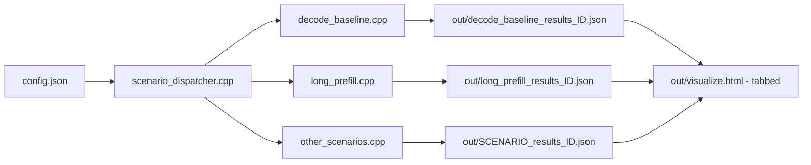

# GenAI Engine Benchmark Design

## Goal
Provide a reproducible native benchmark harness for ONNX Runtime GenAI that runs scenario-driven tests, captures latency/throughput metrics, and writes human-readable outputs for regression tracking.

## High-Level Architecture


## File Structure
Current benchmark engine layout:

```text
onnxruntime-genai/benchmark/engine/
|- .gitignore
|- benchmark-design.md
|- benchmark-requirements.md
|- scenario_dispatcher.cpp
|- CMakeLists.txt
|- config.json
|- data/
|   |- README.md
|   |- ruler/
|       |- prompts.json
|- README.md
|- scenarios/
    |- decode_baseline.cpp
    |- long_prefill.cpp
    |- {other_scenarios}.cpp
    |- utils.cpp
```

## Data Setup (RULER)

For reproducible long-context benchmarks, we keep a pinned prompt subset (adapted from https://github.com/NVIDIA/RULER) in this repository.

Example prompts.json:
```json
{
  "dataset": "RULER",
  "version": "subset_v1",
  "source_branch": "rulerv2-ns",
  "description": "Single-file curated subset with 5 prompts per prompt token-length bucket.",
  "length_buckets": {
    "4k": [
      "[RULER 4K token length sample 0] Full prompt text goes here.",
      "[RULER 4K token length sample 1] Full prompt text goes here.",
      "[RULER 4K token length sample 2] Full prompt text goes here.",
      "[RULER 4K token length sample 3] Full prompt text goes here.",
      "[RULER 4K token length sample 4] Full prompt text goes here."
    ],
    "16k": [
      "[RULER 16K token length sample 0] Full prompt text goes here.",
      "..."
    ],
    "18k": [
      "..."
    ],
    "32k": [
      "..."
    ],
    "48k": [
      "..."
    ],
    "64k": [
      "..."
    ],
    "96k": [
      "..."
    ],
    "128k": [
      "..."
    ]
  }
}
```

## Scenario Dispatcher Responsibilities

The scenario dispatcher is responsible for:

- validating that required config entries/fields are present (without enforcing scenario-specific semantic validity)
- iterating over multiple scenario entries in a single config file
- dispatching each entry to the appropriate scenario implementation and coordinating multiple scenario runs per invocation

## Scenario Responsibilities
Each scenario implementation file (under `scenarios/`) is responsible for:

- validating that inputs are valid for that scenario
- running the benchmark and recording scenario-appropriate metrics
- producing scenario JSON outputs under `out/` (no per-scenario HTML)

The dispatcher/visualizer is responsible for:

- generating one `out/visualize.html` per benchmark invocation
- discovering `out/*_results_*.json` files and rendering each scenario in a tab
- grouping multiple runs of the same scenario (different `{id}` values)

## Data Contract (ie. config.json)
`model_uri` is used below as a short placeholder for the model location.
Example full value: https://foundrylocalmodels.blob.core.windows.net/staging/qwen2.5-0.5b-instruct

- Input config fields per entry:

```json
{
    "scenario": "decode_baseline", // choices=[other scenarios, ...]
    "concurrency": 1, // choices=[1, 2, 4, 8]
    "prompt_length_k": 4, // choices=[4, 16, 18, 32, 48, 64, 96, 128]
    "synthetic": false, // choices=[true, false]
    "model_path": $model_uri,
    "execution_provider": "cuda"
}
```

- Output artifacts:
  - `out/<scenario>_results_<id>.json`: run status, metadata, summary percentiles, and raw request-level records.
  - `out/visualize.html`: single tabbed local chart/table view over all result files found in `out/`.

- File naming convention:
  - `<scenario>` is the scenario name from config (for example `decode_baseline`, `long_prefill`).
  - `<id>` is a zero-padded 3-digit sequence based on scenario order in `config.json` (001, 002, 003, ...).
  - Example output set for one invocation:

```text
out/
|- decode_baseline_results_001.json
|- long_prefill_results_002.json
|- other_scenarios_results_003.json
|- visualize.html
```

## Metrics Strategy

Core Metrics (all scenarios)

- config metadata:
    - scenario, model_path, execution_provider, concurrency, prompt length, synthetic
    - ort_version, genai_version
- run status:
	- status, error (if any)
- request-level latency/throughput:
	- ttft_ms, e2e_ms, generated_tokens_per_s
- summary percentiles:
	- ttft_p50_ms, ttft_p95_ms
	- e2e_p50_ms, e2e_p95_ms
	- tokens_per_s_p50
- memory baseline:
	- peak_memory_bytes (required for all scenarios)

Scenario-Specific Metrics (optional extensions)

- ex. decode_baseline:
	- output text capture for correctness checks
	- optional inter-token latency distribution details

Example `out/decode_baseline_results_001.json` shape:

```json
{
    "scenario": "decode_baseline",
    "config_metadata": {
        "model_path": $model_uri,
        "ort_version": "1.27.0",
        "genai_version": "0.14.1",
        "execution_provider": "cuda",
        "concurrency": 4,
        "prompt_length_k": 4,
        "synthetic": true,
        "generation_tokens": 128,
        "measured_runs": 2
    },
    "status": "success",
    "error": null,
    "core_metrics": {
        "summary": {
            "ttft_ms": {
                "p50": 0,
                "p95": 0
            },
            "e2e_ms": {
                "p50": 0,
                "p95": 0
            },
            "tokens_per_s": {
                "p50": 0
            },
            "peak_memory_bytes": 0
        },
        "raw_requests": [
            {
                "request_id": 0,
                "ttft_ms": 0,
                "e2e_ms": 0,
                "generated_tokens_per_s": 0
            }
        ]
    },
    "scenario_metrics": {
        "outputs": [],
        "inter_token_latency_ms": {
            "p50": 0,
            "p95": 0
        }
    }
}
```

This hybrid model keeps cross-scenario comparison clean while still allowing each scenario to report what matters most.

## Build and Runtime
- Build system: CMake + C++17.
- Links against onnxruntime-genai and onnxruntime libraries.
- Runs as a native C++ executable (no Python required to execute).
