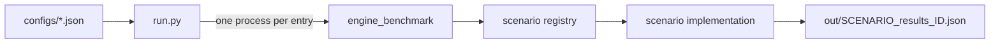

# GenAI Engine Benchmark Design

## Architecture



`run.py` is the recommended entry point for a matrix. It:

- validates that the config is a non-empty JSON array;
- replaces the output directory at the start of the run;
- assigns one configured GPU to each scenario process;
- runs scenarios concurrently up to the number of GPUs;
- moves each result to its matrix-order filename; and
- returns nonzero when any scenario fails.

A fresh process keeps CUDA state, ONNX Runtime allocators, and paged-cache capacity decisions from
leaking between scenarios.

## Native executable

`scenario_dispatcher.cpp` parses config entries, registers provider libraries, dispatches scenarios,
and writes JSON results. CUDA and WebGPU provider paths default to libraries staged beside the
executable; `execution_provider_library` remains available as an override.

Scenarios register themselves with `ScenarioBase::Registrar`. Adding a scenario requires its source
files and a `CMakeLists.txt` entry, but no dispatcher branch.

`ScenarioBase::Run` owns the common result envelope and failure handling. Scenario implementations
own semantic validation, workload execution, and scenario-specific metrics.

## Runtime layout

`build.py --build_engine_benchmark` stages this Linux x64 runtime beside the executable:

```text
build/Linux/<config>/benchmark/engine/
|- engine_benchmark
|- libonnxruntime.so
|- libonnxruntime.so.1 -> libonnxruntime.so
|- libonnxruntime_providers_cuda.so
|- libonnxruntime-genai.so
|- libonnxruntime-genai-cuda.so
`- versions.json
```

The ONNX Runtime and CUDA plugin packages are pinned in
`tools/python/util/dependency_resolver.py`. Locally built GenAI libraries are copied into the same
directory and patched to use `$ORIGIN` as their RPATH.

## Data flow

Each scenario uses deterministic RULER prompts from `data/ruler/prompts.json`. The model path points
to a paged-attention GenAI model. Scenario defaults and constraints are documented in the
[README](../README.md#configuration).

The executable writes one file per config entry:

```text
out/<scenario>_results_<three-digit matrix index>.json
```

The common result envelope is:

```json
{
  "scenario": "decode_baseline",
  "config_metadata": {
    "model_path": "~/models/qwen2.5-0.5b-instruct",
    "ort_version": "...",
    "genai_version": "...",
    "cuda_plugin_ep_version": "...",
    "execution_provider": "cuda",
    "concurrency": 1,
    "prompt_length_k": 4,
    "generation_tokens": 256,
    "warmup_runs": 5,
    "measured_runs": 20
  },
  "status": "success",
  "error": null,
  "core_metrics": {
    "summary": {
      "ttft_ms": { "p5": 0, "p50": 0, "p95": 0 },
      "inter_token_latency_ms": { "p50": 0, "p95": 0 },
      "peak_device_memory_mb": 0,
      "steady_state_device_memory_mb": 0
    },
    "raw_requests": []
  },
  "scenario_metrics": {}
}
```

A caught exception produces the same envelope with `status: "failed"`, the exception text in
`error`, and empty metric objects. Incomplete requests also fail the result.

## Memory sampling

`MemorySampler` polls host and NVIDIA device memory on a background thread. It prefers process-level
NVML usage. If that is unavailable, it reports device-wide growth from the pre-model baseline. GPU
metrics are zero when NVML cannot be loaded; device-wide measurements require an otherwise idle GPU
to be meaningful.
