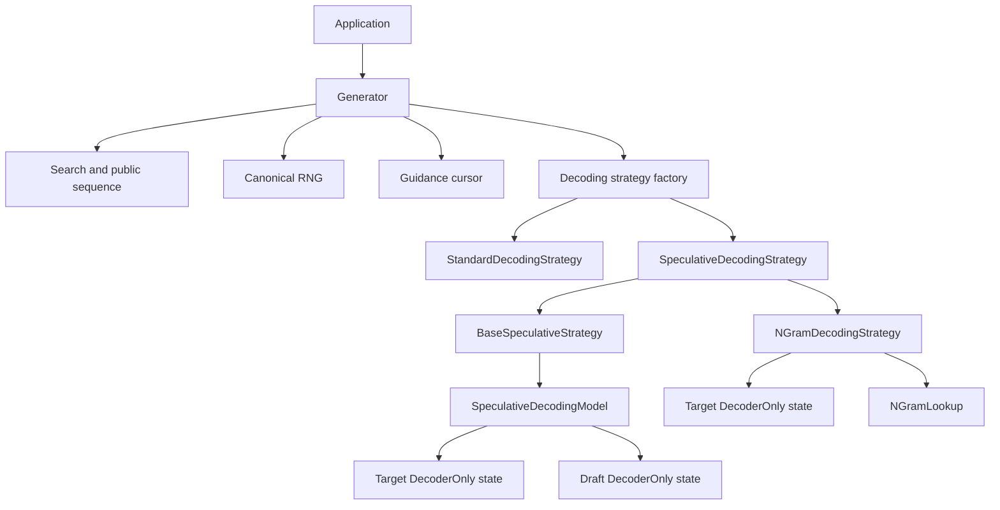
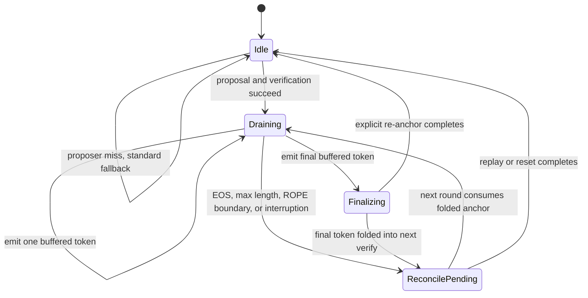

# Speculative decoding architecture

This document describes the implementation contracts for base speculative decoding and n-gram
decoding. It is intended for maintainers changing proposal, verification, buffering, cache,
guidance, sampling, continuation, or statistics behavior. For setup and public configuration, see
[Speculative decoding](SpeculativeDecoding.md).

## Source map

| Area | Primary files |
| --- | --- |
| Strategy selection | [`src/decoding/decoding_strategy.cpp`](../src/decoding/decoding_strategy.cpp) |
| Shared speculative lifecycle | [`src/decoding/speculative_decoding_strategy.h`](../src/decoding/speculative_decoding_strategy.h), [`src/decoding/speculative_decoding_strategy.cpp`](../src/decoding/speculative_decoding_strategy.cpp) |
| Draft-model proposer | [`src/decoding/base_speculative_strategy.h`](../src/decoding/base_speculative_strategy.h), [`src/decoding/base_speculative_strategy.cpp`](../src/decoding/base_speculative_strategy.cpp) |
| N-gram proposer | [`src/decoding/n_gram_decoding_strategy.h`](../src/decoding/n_gram_decoding_strategy.h), [`src/decoding/n_gram_decoding_strategy.cpp`](../src/decoding/n_gram_decoding_strategy.cpp) |
| N-gram history index | [`src/decoding/n_gram_lookup.h`](../src/decoding/n_gram_lookup.h) |
| Composite target/draft model | [`src/models/speculative_decoding.h`](../src/models/speculative_decoding.h), [`src/models/speculative_decoding.cpp`](../src/models/speculative_decoding.cpp) |
| Acceptance and correction math | [`src/decoding/speculative_sampling.h`](../src/decoding/speculative_sampling.h) |
| Statistics contract | [`src/decoding/speculative_stats.h`](../src/decoding/speculative_stats.h), [`src/ort_genai_c.cpp`](../src/ort_genai_c.cpp) |
| Shared search/logits processing | [`src/sampling_distribution.h`](../src/sampling_distribution.h), [`src/search.cpp`](../src/search.cpp) |
| Core tests | [`test/cpp/speculative_sampling_tests.cpp`](../test/cpp/speculative_sampling_tests.cpp), [`test/cpp/n_gram_lookup_tests.cpp`](../test/cpp/n_gram_lookup_tests.cpp), [`test/cpp/n_gram_decoding_strategy_tests.cpp`](../test/cpp/n_gram_decoding_strategy_tests.cpp) |
| Model-backed tests | [`test/python/models/test_speculative_decoding.py`](../test/python/models/test_speculative_decoding.py), [`test/python/models/test_n_gram_decoding.py`](../test/python/models/test_n_gram_decoding.py) |

## Component topology

`Generator` owns the public sequence, canonical RNG, guidance cursor, model state, search state,
and selected `DecodingStrategy`. The factory chooses strategies in this order:

1. Transducer strategy for transducer models.
2. `BaseSpeculativeStrategy` when `model.draft` is configured.
3. `NGramDecodingStrategy` when `speculative.ngram_size > 0`.
4. Standard decoding otherwise.

Generator validation rejects the simultaneous draft-model and n-gram configuration before
generation.



`SpeculativeDecodingStrategy` owns verification, acceptance, buffered delivery, target cache
reconciliation, transactional RNG delivery, adaptive K, cooldown, and shared statistics. A
subclass owns only proposer-specific state and implements:

- `Propose`: produce up to K candidate tokens and declare their proposal semantics.
- `Advance`: update proposer state after a completed round.
- `ReconcileProposer`: rebuild proposer state after target replay.
- `FinalizeGuidanceProposer`: apply the actual committed guided sequence to proposer state.
- `ResetProposer`: clear proposer state after rewind/reset.
- `PopulateProposerStats`: add proposer-specific observability.

## Authoritative state

Several token lengths can differ during a round. They must not be treated as interchangeable.

| State | Owner | Meaning |
| --- | --- | --- |
| Public sequence | `Search` | Tokens externally committed through `CommitToken`; this is the authoritative visible sequence |
| Pending output | `RoundState::pending` | Already-decided tokens not yet visible to the caller |
| Target state | `target_state_` | KV/cache state after verification, rewind, fold, or replay; it can be ahead of or one token behind the public sequence |
| Draft state | `SpeculativeDecodingState::draft_state_` | Draft KV state and pending next-token logits |
| N-gram history | `NGramLookup` | Index of committed tokens only; never includes unverified proposals |
| Guidance state | `ConstrainedLogitsProcessor` | Grammar cursor for externally committed output plus managed lookahead clones/fast-forward queues |
| Canonical RNG | `Generator::rng_` | Sampling stream committed only as corresponding tokens become externally visible |

The public sequence is the source of truth when external operations interrupt a round. Target,
draft, n-gram, guidance, and pending RNG state must reconcile to that sequence or be discarded.

## Round state machine

`RoundState` has four phases:

- `kIdle`: no deferred cache work and no active buffered round.
- `kDraining`: a round has decided output and is emitting it one token per API call.
- `kFinalizing`: the final buffered token was emitted and cache/proposer finalization is running.
- `kReconcilePending`: the public sequence and internal target/proposer state require a fold or
  replay before an external operation or standard step.



Normal transitions are:

```text
Idle/ReconcilePending -> Draining -> Finalizing -> Idle/ReconcilePending
```

An interruption may instead produce:

```text
Draining -> ReconcilePending -> replay committed tail -> Idle
```

### Draining invariants

While `phase == kDraining`:

- `pending` is non-empty.
- `proposal`, `seed_length`, `k`, `n_direct`, and `final_token` describe the round that produced
  the queue.
- The queue contains exactly the accepted direct tokens followed by one correction or bonus token,
  plus any grammar-forced output for a guidance round.
- Sampling rounds have exactly one post-output RNG checkpoint per pending token.
- Non-guidance rounds retain target selection rows only for direct tokens whose logits may be
  observed through `GetLogits()`.
- A caller observes at most one newly committed token from each `GenerateNextToken()` call even
  though the round's compute happened up front.

### Reconciliation invariants

When `phase == kReconcilePending`, at least one of these conditions holds:

- A folded `pending_anchor_token_` has not yet been run through the target.
- Verification moved the target ahead of the externally committed prefix.
- EOS, max length, a ROPE boundary, or an external operation discarded pending output.

Before appending or replacing logits, the strategy rewinds to a floor known to be consistent and
replays the committed tail. It then invokes `ReconcileProposer` so the target and proposer agree
with the public sequence.

## Normal round data flow

A successful round has five logical stages.

```mermaid
sequenceDiagram
    participant App
    participant Generator
    participant Proposer
    participant Target
    participant Search

    App->>Generator: GenerateNextToken()
    Generator->>Proposer: Propose(K, committed prefix, round RNG)
    Proposer-->>Generator: proposal tokens and mode
    Generator->>Target: multi-token verification run
    Target-->>Generator: target rows for proposal positions
    Generator->>Generator: accept prefix; choose correction or bonus
    Generator->>Generator: queue committed round output
    Generator->>Search: emit one queued token
    Search-->>App: one newly visible token
    loop Later GenerateNextToken calls
        Generator->>Search: emit one queued token
    end
    Generator->>Target: rewind/re-anchor or defer folded anchor
    Generator->>Proposer: Advance(actual committed result)
```

### 1. Select K

Fixed mode uses `max_draft_tokens`. Adaptive mode starts at `min_adaptive_k` and uses the current
controller width. K is then clamped by remaining `max_length` budget and applicable long-context
ROPE boundaries.

### 2. Propose

`Propose` returns tokens and one explicit `ProposalMode`:

| Mode | Producer | Verification semantics |
| --- | --- | --- |
| `kGreedyMatch` | Draft model under greedy target search | Accept while draft token equals processed target argmax |
| `kDraftSampling` | Draft model under sampling | Use rejection sampling with draft and target probabilities |
| `kDeterministic` | N-gram lookup | Draw from the target distribution and accept while the draw equals the deterministic proposal |

The mode, not the presence of probability storage, selects the verifier behavior.

A zero-length proposal does not start a speculative round. The strategy reconciles a pending folded
anchor if necessary and executes one standard decoding step. N-gram lookup misses use this path.

### 3. Verify

The verifier must obtain a row for each proposal position. The first target distribution (`pos0`)
normally comes from the logits already computed for the committed prefix. A target that returns
full multi-token logits provides the subsequent rows and trailing bonus distribution from the
verification run. Base speculative decoding can reconstruct these rows with one sequential target
run per proposal token when the model returns only its final logits row. N-gram decoding rejects
last-token-only output because its contract requires full rows from the multi-token run.

Processed target rows use the same minimum-length, repetition-penalty, top-k, top-p, temperature,
and guidance operations as the corresponding regular decode path. Storage remains sparse:

- Greedy verification stores only the selected target token ID.
- Sampling stores the truncated categorical token IDs and probabilities.
- Only a correction or bonus row is densified when required.

This avoids retaining K full vocabulary rows in CPU memory.

### 4. Accept, correct, or add a bonus

Greedy draft-model and deterministic n-gram proposals accept a prefix while their tokens equal the
target-selected tokens. Draft-model sampling accepts proposal token `x_i` with:

```text
accept_probability = min(1, p_target(x_i) / p_draft(x_i))
```

At the first draft-sampling rejection, the correction distribution is:

```text
normalize(max(0, p_target - p_draft))
```

At the first greedy or deterministic rejection, the already-selected target token is the
correction. If every proposal token is accepted, the trailing target distribution supplies one
bonus token. A non-empty round therefore queues accepted direct tokens plus exactly one correction
or bonus token, subject to EOS, maximum-length, and guidance boundaries.

### 5. Drain and finalize

The round queues its selected output, enters `kDraining`, and emits one token per `Step`. Finalizing
is delayed until the queue empties. This preserves the public API and avoids a wasted re-anchor if
EOS or maximum length ends generation while output remains buffered.

After draining, target verification state is rewound to the accepted prefix. The final correction
or bonus token is handled by one of two paths:

- **Explicit re-anchor:** run the final token through the target now and return to `kIdle`.
- **Fold:** retain the final token as `pending_anchor_token_`; the next verification batch inserts
  it before the new proposal, filling the cache gap and producing `pos0` without a separate target
  run. The state remains `kReconcilePending` until that fold is consumed.

The fold is used for multi-token targets with K at least 2 when no boundary requires explicit
re-anchoring. K=1 and applicable boundary cases use the explicit path.

## Base speculative decoding

`SpeculativeDecodingModel` composes two `DecoderOnly_Model` instances under one public model. Prefill
runs both children and stores the draft's next-token logits. Target and draft configurations are
cloned independently so each child owns its own session and state.

### Propose

The draft runs autoregressively for up to K positions:

- Greedy mode chooses the draft argmax.
- Sampling mode applies the configured search processing and samples from the draft distribution.
- Guidance uses a cloned grammar cursor so lookahead does not advance externally visible grammar
  state.
- The proposal stores probability rows only for draft-sampling verification.

### Advance and reconcile

After target acceptance:

- A fully accepted proposal can retain the draft's existing progress and advance on the bonus.
- A rejected proposal rewinds the draft to the accepted prefix and advances on the correction.
- Guidance finalization uses the actual committed sequence, including correction and forced tokens,
  rather than assuming it matches the original proposal.
- Append reconciliation rewinds/replays the draft alongside the target and refreshes pending draft
  logits.

### Composite model contracts

Construction validates:

- A configured draft filename.
- Exact target/draft provider and provider-option equality.
- No target or draft pipeline.
- No vision or speech component.
- No physically sliding cache or hybrid layer state.
- Static positive and equal target/draft logits vocabulary dimensions.

Adapters apply to the target only because the draft can be a different architecture.

## N-gram decoding

`NGramDecodingStrategy` uses the target model's committed history as a deterministic proposer. It
does not create a second model or execute draft forward passes.

### Index structure

For n-gram order N, `NGramLookup` indexes each committed `(N-1)`-token key to the start of its most
recent prior occurrence. Keys are token vectors stored in an `unordered_map`; hash collisions remain
safe because vector equality is checked. Repeated equal keys replace the older position.

Normal generation appends only newly committed suffixes. Rewind or replacement resets and rebuilds
the index from the authoritative committed sequence. Worst-case storage is:

```text
O(sequence_length * ngram_size)
```

The history itself is stored once, while each indexed suffix owns its key vector.

### Contiguous lookup

The default lookup matches the current `(N-1)` suffix and copies up to K committed tokens after the
most recent prior occurrence. If no complete continuation exists, it returns an empty proposal and
the shared strategy performs one standard fallback step.

### Chained lookup

Chained lookup takes the first exact continuation token, advances a local synthetic context, and
performs another exact lookup. It repeats until K tokens are proposed or a lookup, grammar, EOS, or
length boundary stops the chain.

Synthetic tokens never modify committed history or the index. Only output that becomes externally
committed is synchronized later.

### Sampling semantics

An n-gram proposal has no probability distribution of its own. Under target sampling, the verifier
draws from each processed target row and accepts the deterministic proposal while it equals those
draws. The first mismatch commits the target draw as the correction. This reproduces the target
sampling stream without constructing a one-hot draft distribution.

### Additional capability guards

N-gram decoding rejects:

- A configured draft model.
- Batch size greater than one, beams, or multiple return sequences.
- Pipeline, multimodal, audio, hybrid, or otherwise non-plain decoder-only models.
- Physically sliding or model-managed state.
- Pruned last-token-only logits.

These restrictions ensure that target verification can obtain every row and that rewind/replay can
restore target state exactly.

## Transactional RNG ownership

`Generator::rng_` is the canonical sampling stream. A speculative round may calculate several
future outputs before the caller observes them, so mutating the canonical RNG during round
construction would make discarded work externally visible through later randomness.

Sampling therefore uses a round-local RNG copy and stores one post-output checkpoint for every
queued token. `DrainOne` applies a checkpoint immediately before its corresponding token becomes
visible. If append, rewind, `SetLogits`, EOS, or maximum length discards later buffered tokens, their
checkpoints are discarded too.

The invariant is:

```text
sampling round: pending_rng_states.size() == pending.size()
non-sampling round: pending_rng_states is empty
```

Grammar-forced tokens consume no random draw but still receive the unchanged checkpoint associated
with their output position. Explicit `RoundState::uses_rng_checkpoints` distinguishes a legitimate
non-sampling empty queue from a sampling checkpoint underrun.

## Guidance interaction

Guidance lookahead must not advance the public grammar cursor for tokens that might be rejected or
discarded.

Proposal behavior:

- Base speculative decoding clones the current grammar cursor for draft lookahead.
- N-gram decoding checks deterministic lookup candidates against an independent lookahead cursor.
- Grammar-invalid candidates truncate the proposal before target verification.
- Grammar fast-forward tokens can participate in the verification batch and committed output.

Verification behavior:

- A guidance round uses `RunGuidanceRound` rather than the normal verifier.
- Each target row is grammar-masked before search penalties and selection.
- Draft-model sampling uses target/draft rejection sampling on the masked distributions.
- Deterministic n-gram sampling draws from the masked target and compares the draw with the proposal.
- Accepted, correction, and forced tokens are committed to the externally visible grammar state in
  output order.

Guidance rounds can require replay of committed forced/correction tokens beyond the target's verified
prefix. `FinalizeGuidanceRound` performs that replay and passes the actual committed sequence to the
proposer-specific finalizer.

External logits are intentionally restricted while a guided round has buffered tokens because the
single externally meaningful grammar/logits position cannot be reconstructed from an arbitrary
lookahead row without committing or discarding state.

## External operations

| Operation | Idle | Draining or folded state | Result |
| --- | --- | --- | --- |
| `GenerateNextToken` | Starts a round or standard fallback | Emits one pending token | Preserves one-token-per-call visibility |
| `AppendTokens` | Appends and computes fresh logits | Discards unobserved output, replays committed tail, reconciles proposer, then appends | Public sequence remains authoritative |
| `RewindTo` | Rewinds search/model state | Rewinds state and resets strategy/pending work | Adaptive estimates reset to configured floor; cumulative telemetry counters remain |
| `GetLogits` | Returns current logits, computing after rewind if needed | Returns a cached target row when valid; otherwise reconciles; guided buffering is rejected | Does not consume output or RNG |
| `SetLogits` | Replaces current search logits | Reconciles and discards invalid speculative work before replacement; guided buffering is rejected | Future proposals derive from replacement logits |
| EOS or maximum length | Marks completion | Emits allowed output, discards the rest, skips unnecessary re-anchor | Discarded output and RNG work remain invisible |

### Append replay

At round start, target and proposer state agree at `seed_length`. If append interrupts later, the
strategy chooses `floor = max(seed_length - 1, 0)`, discards pending output and external-logit
caches, rewinds below the stable boundary, and replays the public committed tail. Replay updates the
target first and calls `ReconcileProposer` for draft or n-gram state.

### Rewind reset

`Generator::RewindToLength` rewinds search and model state, resets guidance, calls strategy `Reset`,
marks logits stale, and records `Action::rewound`. A later `GenerateNextToken` or `GetLogits` replays
the boundary token to refresh target logits and proposer state.

Strategy reset clears pending output, pending external-logit views, folded anchors, fast-forward
carry, adaptive estimates, cooldown streak, and proposer state. It does not erase cumulative
speculative counters such as rounds, accepted tokens, adaptive moves, or cooldown entries.

## Target logits and cache requirements

Verification needs one target distribution per proposal position. `DecoderOnly_State::RunUnchunked`
bypasses prefill chunking for the verification input because chunked prefill can expose only the
final chunk's logits. This is a correctness requirement, not a general recommendation to disable
prefill chunking. If the output still contains only the final row, base speculative decoding
rewinds and reconstructs the rows with sequential target runs; n-gram decoding fails fast.

The target output may be FP16 or FP32. `GetFloatVerifyLogits` wraps FP32 directly and casts other
supported output types to FP32 before CPU-side row processing.

An EP/model combination is viable only when it can:

- Execute variable-width multi-token decode inputs used by verification.
- Return full verification rows, or support base speculative decoding's sequential last-row-only
  fallback.
- Rewind or replay state to the accepted prefix.
- Preserve the documented target cache position after each run.

Model-managed state, static decode shapes, pruned logits, or provider-specific cache behavior must
be assessed by these contracts rather than by provider name alone.

## Statistics lifecycle

Statistics separate speculative work from externally delivered output:

- A round begins only after a non-empty proposal is verified and output is queued.
- `tokens_queued` counts all selected output at round construction.
- `tokens_emitted` increases only after `CommitToken` extends the public sequence.
- `tokens_discarded` includes queued output invalidated before external delivery.
- A round completes after the final queued token is delivered and finalization runs.
- An external interruption increments interrupted-round accounting when pending output is
  discarded.
- N-gram lookup misses are standard fallback steps, not zero-token speculative rounds.
- Guidance rounds disable formula-based speedup estimates because their forced-token and replay
  behavior does not satisfy the simple analytical model.

`GetSpeculativeStats` returns a snapshot assembled from shared accumulators, current `RoundState`,
adaptive/cooldown controllers, and proposer-specific counters. Field definitions and formulas are
documented in [Speculative decoding](SpeculativeDecoding.md#statistics).

## Correctness checklist for changes

Changes to the speculative path should preserve these properties:

### Output and target semantics

- Greedy output matches target-only greedy output for supported models and settings.
- Sampling uses the canonical target distribution, including guidance and search processing.
- A non-empty round selects between one and K+1 output tokens before EOS/length handling.
- Only target-approved tokens reach the public sequence.

### State and lifecycle

- Target and proposer agree at every externally stable boundary.
- Unverified proposal tokens never enter n-gram history or public guidance state.
- Append, rewind, `GetLogits`, and `SetLogits` cannot expose stale buffered work.
- Folded anchors are either consumed by the next verify or explicitly reconciled before another
  operation.
- EOS and maximum length can discard remaining work without requiring a wasted re-anchor.

### Sampling

- Exactly one RNG checkpoint exists per queued sampling output.
- Canonical RNG advances only when output becomes externally visible.
- Interrupted or discarded output does not affect later sampling.
- Standard fallback and speculative paths use the same generator-owned RNG stream.

### Observability

- Proposed, evaluated, accepted, queued, emitted, and discarded counts remain distinct.
- Target verify, re-anchor, and lifecycle reconciliation executions are attributed separately.
- N-gram lookup misses are distinguishable from zero-accept verification rounds.
- Formula fields are disabled when their assumptions do not hold.

### Minimum validation

- Native acceptance/correction and controller unit tests.
- N-gram index tests for misses, latest occurrence, chained cycles, reset, and maximum K.
- Model-backed greedy and fixed-seed sampling comparisons.
- Early rejection, late rejection, and all-accepted bonus paths.
- Append, rewind/resume, external logits, and interrupted buffered rounds.
- Guidance acceptance, rejection, correction, and fast-forward output.
- Shared and non-shared cache configurations on each claimed EP/model export.
- Statistical sampling parity or task-quality comparison across multiple seeds for behavior-affecting
  sampling changes.