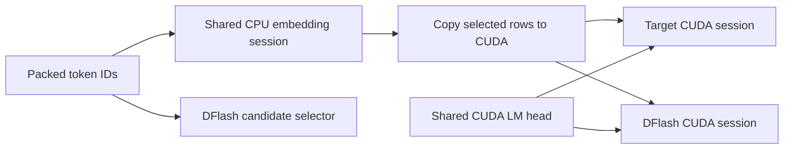

# CPU embedding with CUDA graph decoding

## Problem and design

Putting an embedding lookup on CPU inside a decoder or DFlash ONNX graph makes that
session mixed-device. CUDA graph capture cannot replay the CPU lookup. Disabling
capture only for prefill does not solve the mixed-device decode graph.

Split the embedding lookup into a separate CPU-only ONNX session. Run it eagerly
before each target/drafter invocation, bind its output to pinned host memory, copy only
the selected rows to CUDA, and bind those rows as `inputs_embeds`. The target and
DFlash share one `CpuEmbedding` session and therefore one copy of the embedding table
in host memory. Their LM head remains shared through the existing CUDA shared-initializer
mechanism.



The target uses `VarlenGraphBuffers` for embedding storage during captured steps.
This storage is included in the Engine's automatic memory budget and never grows
after capture. Eager prefill owns its temporary output. DFlash uses its existing
`StepTensor` mechanism, including graph retirement when a buffer grows. Embedding
lookup and host-to-device copies happen before `OrtSession::Run`, outside capture.
Consequently replay reads updated values at the same device address on every step.

Keep DFlash's `input_ids`: the selector also uses them. Extract only the embedding
lookup, leaving subsequent casts and all other operators in their original graphs.
This matters when target and drafter computation use different floating point types.
The CPU output must exactly match each consumer's declared type and hidden width.

## Configuration and conversion

The implementation reuses `model.embedding`, with CPU-only session options:

```json
{
  "model": {
    "embedding": {
      "filename": "embedding.onnx",
      "session_options": {"intra_op_num_threads": 1},
      "inputs": {"input_ids": "input_ids"},
      "outputs": {"inputs_embeds": "inputs_embeds"}
    },
    "decoder": {"inputs": {"inputs_embeds": "inputs_embeds"}},
    "dflash2": {"inputs": {"inputs_embeds": "inputs_embeds"}}
  }
}
```

Retain the remaining configuration fields and enable `enable_cuda_graph` on the
decoder/drafter as usual. Embedding session options are created independently;
they do not inherit CUDA providers, graph capture, or CUDA shared initializers.

Convert an existing packed model without re-exporting or copying its large weights:

```bash
python src/python/py/models/split_cpu_embedding.py \
  --input /path/to/original-model --output /path/to/cpu-embedding-model
```

The destination must be new. It contains rewritten ONNX metadata, `embedding.onnx`,
updated configuration, and hard links to the source data/tokenizer files on the same filesystem.
Treat these shared data files as immutable. Embedding initializers are removed from both GPU graphs and their
`shared_initializers` lists. The converter verifies that target and drafter lookup
attributes and referenced weight storage match before sharing the CPU session.

## Scope and tradeoffs

This path supports packed dynamic-batching Engine models and DFlash/DSpark. The
Generator API, static batching, multimodal embedding pipelines, and MTP integration
are outside this change. Unsupported entry points fail explicitly. The converter
accepts a direct axis-zero `Gather` or `GatherBlockQuantized`, with a logical
`[vocab_size, hidden_size]` weight. It refuses weights with other consumers or a
different embedding in the drafter; it does not silently offload a tied LM head.

CPU lookup adds host work and a small host-to-device transfer every invocation.
Target tokens produced on CUDA require readback for lookup. Decode should still
benefit from capture, but performance must be measured against both the original
GPU embedding and CPU embedding with capture disabled. Prefill remains eager.

For the supplied Qwen INT4 table, weights plus scales occupy 715,161,600 bytes
(682.03 MiB). These move out of device memory. An eight-token lookup transfers
81,920 bytes (FP16, hidden size 5120). Allocator and graph workspace changes can make
the measured peak-memory difference differ from the table size.

## Validation

1. Test conversion, including preservation of DFlash's non-embedding token-ID use,
   shared weight checks, external data offsets, and rejection of unsafe splits.
2. Compare CPU and CUDA lookup output bytes, including repeated and boundary IDs.
3. Run the supplied model through the Engine with GPU embedding and CPU embedding,
   each with eager and captured decode; compare greedy token streams and drafter
   statistics. Include long/chunked prefill, repeated requests, and multiple batches.
4. Verify actual CUDA graph replay in both target and drafter, not just configured
   provider options; record loaded library paths, phase timings, and GPU memory.
