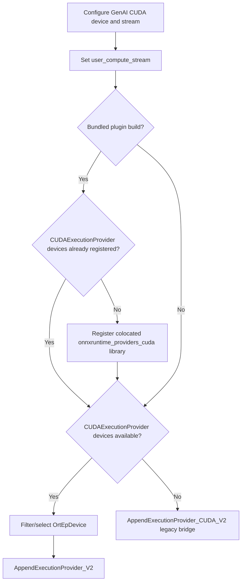

# CUDA Plugin Execution Provider Integration

## Overview

ONNX Runtime can build the CUDA execution provider (EP) in two mutually exclusive forms:

- **CUDA plugin EP** — loaded through the EP Plugin API from
  `libonnxruntime_providers_cuda.so` (`onnxruntime_providers_cuda.dll` on Windows).
- **Legacy CUDA EP** — loaded through the provider-bridge API from the same canonical
  native library filename.

Both forms now advertise the canonical provider name **`CUDAExecutionProvider`**. The
`onnxruntime_BUILD_CUDA_EP_AS_PLUGIN` setting used to build ONNX Runtime determines which
implementation the canonical library contains. There is no longer a separate
`CudaPluginExecutionProvider` identity or an `onnxruntime_providers_cuda_plugin` filename.

ONNX Runtime GenAI continues to use `cuda` as the provider key in `genai_config.json`.
That key selects GenAI's CUDA-specific setup; it is not an ORT registration name.

## Goals

1. Use the V2 EP Plugin API whenever `CUDAExecutionProvider` has registered EP devices.
2. Fall back to the legacy CUDA provider bridge when no registered CUDA EP devices exist.
3. Support a separately installed plugin and a plugin bundled with GenAI.
4. Share GenAI's CUDA stream and forward standard CUDA provider options in both modes.
5. Keep plugin loading out of `genai_config.json`; native library loading remains an
   application or packaging concern.

## Canonical identity

| Property | CUDA plugin EP | Legacy CUDA EP |
| --- | --- | --- |
| ORT provider name | `CUDAExecutionProvider` | `CUDAExecutionProvider` |
| Linux library | `libonnxruntime_providers_cuda.so` | `libonnxruntime_providers_cuda.so` |
| Windows library | `onnxruntime_providers_cuda.dll` | `onnxruntime_providers_cuda.dll` |
| Append API | `AppendExecutionProvider_V2` | `AppendExecutionProvider_CUDA_V2` |
| Discovery | `OrtEnv::GetEpDevices()` | provider bridge |

The two implementations are alternatives, not providers that should be loaded together.
A deployment must not place a legacy CUDA provider library where GenAI expects a bundled
plugin: the filename alone cannot distinguish them.

## EP selection flow

The selection logic lives in
[`src/cuda/session_options.cpp`](../src/cuda/session_options.cpp), in
`CUDAExecutionProvider::AppendExecutionProvider`:

1. Create/get GenAI's CUDA device interface and compute stream.
2. Add `user_compute_stream` to the ORT session configuration.
3. In bundled builds, register the colocated canonical CUDA provider library unless ORT
   has already registered `CUDAExecutionProvider` devices.
4. Search `OrtEnv::GetEpDevices()` for devices named `CUDAExecutionProvider`.
5. If devices exist, apply configured hardware-device filtering, select the first device,
   and append it through `AppendExecutionProvider_V2`.
6. If no devices exist, append the legacy CUDA EP through
   `AppendExecutionProvider_CUDA_V2`.



The canonical name removes the old plugin-first/built-in-V2-first chain. One V2 lookup is
sufficient: registered devices mean the plugin path is available; no devices means GenAI
uses the legacy bridge.

## Deployment layouts

### Separately installed plugin (default)

`REGISTER_BUNDLED_CUDA_PLUGIN_EP=OFF` is the default GenAI build. The application or
plugin package registers the library before constructing a model:

- C: `OgaRegisterExecutionProviderLibrary("CUDAExecutionProvider", path)`
- Python: `og.register_execution_provider_library("CUDAExecutionProvider", path)`
- C++ ORT API: `env.RegisterExecutionProviderLibrary("CUDAExecutionProvider", path)`
- C# ORT API: `OrtEnv.Instance().RegisterExecutionProviderLibrary("CUDAExecutionProvider", path)`

A standalone `onnxruntime-ep-cuda12` or `onnxruntime-ep-cuda13` package may expose the
registration name and absolute library path. Passing those package-provided values is
preferred to constructing a path manually.

This layout allows the CUDA plugin to be installed or upgraded independently. The
application must complete registration before the first GenAI model/session is created.

### Bundled plugin

With `REGISTER_BUNDLED_CUDA_PLUGIN_EP=ON`, the GenAI build:

1. Requires `${ORT_LIB_DIR}/onnxruntime_providers_cuda.*` to exist.
2. Copies that library into packages alongside the GenAI native libraries.
3. Resolves the library next to `libonnxruntime-genai` and registers it as
   `CUDAExecutionProvider` on first CUDA session creation.

The registration is process-wide and idempotent. GenAI first checks for existing
`CUDAExecutionProvider` devices so it coexists with an ORT Python wheel that has already
auto-registered its bundled CUDA plugin. Registration failure is logged as a warning and
GenAI attempts the legacy provider bridge.

Because the plugin and legacy provider have the same filename, this build option must only
be used with an ORT home produced using
`onnxruntime_BUILD_CUDA_EP_AS_PLUGIN=ON`. CMake verifies file presence but cannot infer the
implementation stored in that file.

## Build configuration

The GenAI option is declared in [`cmake/options.cmake`](../cmake/options.cmake):

```cmake
cmake_dependent_option(REGISTER_BUNDLED_CUDA_PLUGIN_EP
  "Auto-register the bundled CUDA plugin EP library" OFF "USE_CUDA" OFF)
```

Examples:

```bash
# Plugin is installed and registered by the application.
python build.py --use_cuda --ort_home <ort-home>

# Canonical CUDA plugin library is copied into the GenAI package and auto-registered.
python build.py --use_cuda --ort_home <plugin-ort-home> \
  --cmake_extra_defines REGISTER_BUNDLED_CUDA_PLUGIN_EP=ON
```

The corresponding ONNX Runtime build must include:

```bash
--cmake_extra_defines onnxruntime_BUILD_CUDA_EP_AS_PLUGIN=ON
```

## Provider options and stream sharing

The provider entry in `genai_config.json` remains `cuda`. Its options are copied into the
V2 option map for plugin sessions. The legacy bridge converts arena options into an
`OrtArenaCfg` and forwards other options through `OrtCUDAProviderOptionsV2`.

Before either append path, GenAI writes its CUDA stream pointer to the
`user_compute_stream` session configuration entry. This keeps model execution, GenAI CUDA
kernels, and CUDA graph capture on the coordinated stream. `enable_cuda_graph` is forwarded
unchanged; non-decoder sessions should disable it in their own session options when graph
capture is unsupported.

CUDA plugin options may use the standard flat CUDA names accepted by ORT, such as
`device_id`, `enable_cuda_graph`, and `enable_cudnn`. ORT also defines the canonical
session-configuration namespace `ep.cuda.*`. No GenAI-only plugin path option is added.

## Packaging

When bundled registration is enabled, [`CMakeLists.txt`](../CMakeLists.txt) appends
`${ORT_LIB_DIR}/${ONNXRUNTIME_PROVIDERS_CUDA_LIB}` to `ortgenai_embed_libs`. This places
the canonical CUDA plugin library next to the GenAI native libraries in the Python wheel,
Java package, and other consumers of that list.

The runtime registration path is resolved relative to the loaded GenAI native library on
Linux and Windows rather than relying only on the process working directory or global
loader search path. Other platforms use the platform filename and loader search path.

The base ONNX Runtime Python wheel can also auto-register a CUDA plugin from its own
`onnxruntime/capi` directory. If that has happened, GenAI detects the existing devices and
does not register its bundled copy.

## Files involved

| File | Responsibility |
| --- | --- |
| [`src/cuda/session_options.cpp`](../src/cuda/session_options.cpp) | Canonical registration, V2 discovery/append, and legacy fallback. |
| [`src/models/session_options.cpp`](../src/models/session_options.cpp) | EP-device discovery, filtering, V2 append, and idempotent library registration. |
| [`cmake/options.cmake`](../cmake/options.cmake) | Bundled-registration build option. |
| [`cmake/check_cuda.cmake`](../cmake/check_cuda.cmake) | Bundled-registration compile definition. |
| [`cmake/global_variables.cmake`](../cmake/global_variables.cmake) | Canonical platform CUDA provider filename. |
| [`CMakeLists.txt`](../CMakeLists.txt) | Validates and embeds the bundled library. |
| [`test/main.cpp`](../test/main.cpp) | Registers canonical plugin libraries supplied through `--ep_dir`. |
| [`test/python/_test_utils.py`](../test/python/_test_utils.py) | Registers an installed `onnxruntime_ep_cuda` package for Python tests. |

## Validation

Validate all three behaviors:

1. **Plugin V2 path:** build ORT with `onnxruntime_BUILD_CUDA_EP_AS_PLUGIN=ON`, register or
   bundle `libonnxruntime_providers_cuda.so`, create a GenAI CUDA model, and verify devices
   named `CUDAExecutionProvider` are available and inference succeeds.
2. **Bundled path:** build GenAI with `REGISTER_BUNDLED_CUDA_PLUGIN_EP=ON`, install the
   wheel, do not call the registration API, and verify model creation/inference succeeds.
3. **Legacy fallback:** build against the legacy CUDA EP with bundled registration off and
   verify the same `cuda` configuration succeeds through the provider bridge.

For plugin validation, also confirm the loaded file exports `CreateEpFactories`; the
canonical filename by itself does not prove that the artifact is the plugin implementation.
