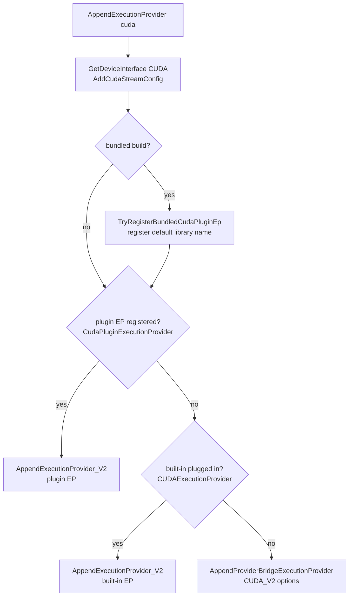

# CUDA Plugin Execution Provider Integration

## Overview

ONNX Runtime exposes the CUDA execution provider (EP) in two forms:

- **Built-in CUDA EP** — compiled into / loaded as the ONNX Runtime CUDA provider and
  appended through the legacy provider-bridge API (`AppendExecutionProvider_CUDA_V2`),
  discovered under the EP name `CUDAExecutionProvider`.
- **CUDA plugin EP** — a standalone shared library
  (`libonnxruntime_providers_cuda_plugin.so` / `onnxruntime_providers_cuda_plugin.dll`)
  registered with the `OrtEnv` and consumed through the **V2 plugin API**
  (`AppendExecutionProvider_V2` over `OrtEpDevice`s), discovered under the EP name
  `CudaPluginExecutionProvider`.

This document describes how onnxruntime-genai integrates the CUDA plugin EP, the two
supported deployment layouts, and the build option that selects between them.

## Goals

1. Let genai prefer the CUDA plugin EP when it is available, while transparently
   falling back to the built-in CUDA EP when it is not.
2. Support **two independent deployment layouts**:
   - **Separate directories** — the plugin library and `libonnxruntime` live in
     different directories so the plugin can be installed/upgraded independently
     (mirrors the NvTensorRtRtx EP).
   - **Same directory (bundled)** — the plugin library ships alongside
     `libonnxruntime` (e.g. the `onnxruntime-genai-cuda` package), so no caller-side
     registration is required.
3. Keep `genai_config.json` a pure ONNX Runtime passthrough — no genai-only provider
   options. The provider name in config stays `cuda`.

## Design

### EP selection flow

The selection logic lives in
[`src/cuda/session_options.cpp`](../src/cuda/session_options.cpp),
`CUDAExecutionProvider::AppendExecutionProvider`. The flow is:

```
GetDeviceInterface(CUDA)                  // genai-owned device + compute stream
AddCudaStreamConfig(...)                  // share genai's stream via user_compute_stream

[bundled build only] TryRegisterBundledCudaPluginEp()   // self-register default library

if AppendExecutionProviderV2("CudaPluginExecutionProvider")   // plugin EP, if present
    -> done
else if AppendExecutionProviderV2("CUDAExecutionProvider")    // built-in plugged in
    -> done
else
    AppendProviderBridgeExecutionProvider(...)                // built-in provider bridge
```

`AppendExecutionProviderV2` calls `FindRegisteredEpDevices(ep_name)` and returns
`false` when no `OrtEpDevice` is registered under that name, so the fallback chain is
driven entirely by **which EP is actually registered** at runtime.



### Who registers the plugin library

Registration of the plugin `.so`/`.dll` with the `OrtEnv` (via
`RegisterExecutionProviderLibrary`) is the only difference between the two deployment
layouts.

| Layout | Build option | Who registers the library | Analogy |
| --- | --- | --- | --- |
| Separate directories | `REGISTER_BUNDLED_CUDA_PLUGIN_EP=OFF` (default) | **Caller**, out-of-band, before model load | NvTensorRtRtx, WebGPU |
| Same directory (bundled) | `REGISTER_BUNDLED_CUDA_PLUGIN_EP=ON` | **genai**, automatically, by default library file name | onnxruntime-genai-cuda package |

In the separate-directory layout genai never registers the library. The caller registers
it once, exactly as is already done for the built-in CUDA EP and the NvTensorRtRtx EP:

- C API: `OgaRegisterExecutionProviderLibrary("CudaPluginExecutionProvider", path)`
- Python: `og.register_execution_provider_library("CudaPluginExecutionProvider", path)`
- C#: `OrtEnv.Instance().RegisterExecutionProviderLibrary("CudaPluginExecutionProvider", path)`

In the bundled layout genai calls `TryRegisterBundledCudaPluginEp()`, which registers the
platform default library file name (`libonnxruntime_providers_cuda_plugin.so` /
`.dylib` / `.dll`). The bare file name is resolved by the OS loader through the
genai/onnxruntime RPATH (`$ORIGIN` on Linux), so the plugin is found next to
`libonnxruntime`. Registration is idempotent (deduped by
`EnsureExecutionProviderLibraryRegistered`) and best-effort: if the library is missing or
fails to load, a warning is logged and the flow falls back to the built-in CUDA EP.

### Build option

Declared in [`cmake/options.cmake`](../cmake/options.cmake):

```cmake
cmake_dependent_option(REGISTER_BUNDLED_CUDA_PLUGIN_EP
  "Auto-register the bundled CUDA plugin EP library" OFF "USE_CUDA" OFF)
```

When `ON`, [`cmake/check_cuda.cmake`](../cmake/check_cuda.cmake) adds the compile
definition `ORTGENAI_REGISTER_BUNDLED_CUDA_PLUGIN_EP=1`, which gates the
`TryRegisterBundledCudaPluginEp()` call and the default-library-name constants in
`session_options.cpp`. The option depends on `USE_CUDA` and defaults to `OFF`, so the
default build is the clean "caller registers out-of-band" model.

Build examples:

```bash
# Default: separate-directory layout, caller registers the plugin out-of-band.
python build.py --use_cuda

# Bundled layout: genai self-registers the plugin shipped next to libonnxruntime.
python build.py --use_cuda --cmake_extra_defines REGISTER_BUNDLED_CUDA_PLUGIN_EP=ON
```

### Stream sharing and CUDA graph

Both the plugin EP and the built-in EP share genai's compute stream. `AddCudaStreamConfig`
writes the genai `cudaStream_t` into the `user_compute_stream` session config entry before
EP selection, so whichever EP is appended runs on the genai stream. CUDA graph capture is
controlled by `enable_cuda_graph` in the decoder session options in `genai_config.json` and
is honored as-is by the selected EP; non-decoder sessions (vision, embedding, speech) should
set `enable_cuda_graph=0` in their own session options.

### Provider options

`provider_options` for the `cuda` provider are forwarded verbatim:

- Plugin EP path: options are passed through `AppendExecutionProvider_V2`.
- Built-in provider-bridge path: arena keys (`max_mem`, `arena_extend_strategy`,
  `initial_chunk_size_bytes`, `max_dead_bytes_per_chunk`,
  `initial_growth_chunk_size_bytes`) are translated into an `OrtArenaCfg`; all other
  keys are forwarded as `OrtCUDAProviderOptionsV2` values; `user_compute_stream` is set
  from the genai stream.

There are no genai-only provider options. The provider name in `genai_config.json` stays
`cuda` in all layouts.

## Comparison with other in-tree plugin EPs

The CUDA plugin EP and the WebGPU/NvTensorRtRtx EPs are all first-party EPs whose source
lives in the onnxruntime repo. genai uses the same "try V2 plugin, else fall back" shape
for all of them:

| EP | V2 registration name | V1 / built-in fallback | Library registration |
| --- | --- | --- | --- |
| WebGPU | `WebGpuExecutionProvider` | legacy by name | auto-surfaced by libonnxruntime (in-tree) |
| NvTensorRtRtx | `NvTensorRTRTXExecutionProvider` | legacy by name | caller, out-of-band |
| CUDA | `CudaPluginExecutionProvider` | built-in provider bridge | caller out-of-band (default) **or** genai bundled (build option) |

The CUDA path adds the bundled self-registration option because, unlike WebGPU, the CUDA
plugin is a separate shared object rather than code surfaced automatically from
`libonnxruntime`.

## Files changed

| File | Change |
| --- | --- |
| [`cmake/options.cmake`](../cmake/options.cmake) | Added `REGISTER_BUNDLED_CUDA_PLUGIN_EP` option (default `OFF`). |
| [`cmake/check_cuda.cmake`](../cmake/check_cuda.cmake) | Emits `ORTGENAI_REGISTER_BUNDLED_CUDA_PLUGIN_EP=1` when the option is `ON`. |
| [`src/cuda/session_options.cpp`](../src/cuda/session_options.cpp) | Try-plugin-then-built-in selection; bundled self-registration guarded by the compile definition. |

## Testing

- **Separate-directory layout (default build):** register the plugin out-of-band, e.g.
  `og.register_execution_provider_library("CudaPluginExecutionProvider", "<plugin dir>/libonnxruntime_providers_cuda_plugin.so")`,
  then run a model with the `cuda` provider and confirm the plugin EP is selected (the
  graph capture/replay log lines mention `CudaPluginExecutionProvider`).
- **Bundled layout (`REGISTER_BUNDLED_CUDA_PLUGIN_EP=ON`):** place the plugin library next
  to `libonnxruntime`, run a model with no caller-side registration, and confirm the plugin
  EP is selected automatically.
- **Fallback:** with no plugin library available, confirm the run falls back to the
  built-in CUDA EP and produces correct output.
