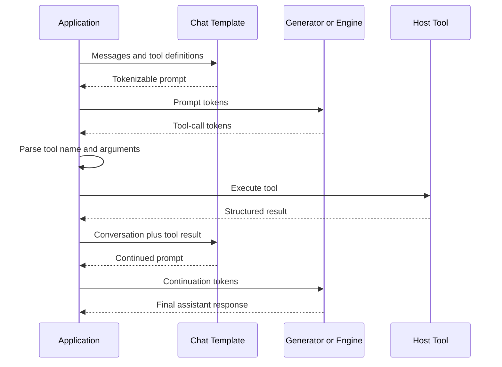
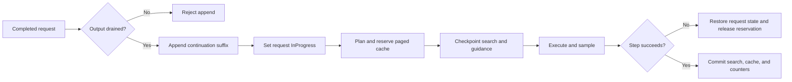

# Tool Calling with the ONNX Runtime GenAI Engine

## Design Summary

**Status:** Implemented and validated on the feature branch  
**Scope:** Add end-to-end tool-calling support to the GenAI `Engine` without changing or removing the existing `Generator` workflow  
**Primary scenario:** Qwen 2.5 tool definition injection, tool-call generation, host-side tool execution, tool-result continuation, and final response generation

## Executive Summary

The ONNX Runtime GenAI `Generator` already supports multi-turn tool-calling workflows, but it uses a model state with a conventional KV cache. The `Engine` supports concurrent request scheduling and, for models configured with dynamic batching, a paged KV cache. Before this change, an Engine request that generated a tool call could complete its first assistant turn, but it could not be resumed after the application supplied the tool result. Appending tokens to a completed request did not make that request schedulable again.

This design adds continuation to the Engine request lifecycle. After the application consumes the generated tool call, it can append the chat-template-derived tool-response tokens to the same completed request. The request becomes active again, the caller-provided tokens are treated as model input rather than generated output, and generation continues from the existing paged KV cache.

The change is additive:

- Existing `Generator` tool calling remains unchanged.
- Existing C and Python Generator examples remain in the end-to-end test path.
- Engine users continue using the existing `Request.add_tokens` API; no tool-specific native API is introduced.
- Tool parsing and execution remain application responsibilities.
- Optional grammar-constrained decoding is supported per Engine request but is not required for native Qwen tool calling.

## Motivation

Long-context agent workflows benefit from the Engine's scheduling and paged-attention capabilities. A typical tool-calling conversation has multiple generation rounds:

1. The application supplies a user message and tool definitions.
2. The model generates a structured tool call.
3. The application executes the tool.
4. The application adds the tool result to the conversation.
5. The model generates a final answer.

Recreating all model state between steps 2 and 5 requires reprocessing the full conversation. For long contexts, this wastes compute and increases latency. With a dynamically batched Engine model, resuming the same request preserves its paged KV-cache ownership and processes only the continuation suffix.

## Goals

- Support a complete Qwen 2.5 tool-calling conversation through the Engine.
- Resume a completed Engine request after the application appends tool-response tokens.
- Preserve paged KV-cache state across tool execution for dynamically batched models.
- Keep caller-provided continuation tokens out of the generated-output stream.
- Prevent accidental loss of generated output when a request is resumed.
- Preserve existing Generator and C API behavior.
- Support optional per-request guidance with Engine transaction semantics.
- Provide focused unit and end-to-end coverage.

## Non-Goals

- Implement tool selection, JSON parsing, tool execution, or retries inside the C++ Engine.
- Define one universal tool-call schema across model families.
- Replace model-specific chat templates.
- Require guidance for tool calling.
- Add support for guidance fast-forward tokens in the Engine.
- Change the existing Generator tool-calling contract.
- Cover GPT-OSS tool calling in this change.

## Existing Architecture

Tool calling is an application-level protocol layered over token generation. The runtime supplies model execution, tokenization, chat-template rendering, search, and streaming. The application owns the semantic loop:



Qwen's chat template places tool definitions in the system prompt and renders assistant tool calls between `<tool_call>` and `</tool_call>` special tokens. It renders the tool result as a tool-response turn before the next assistant generation prompt.

Tokenizer stream decoding can omit special-token text even when those token IDs were generated. Therefore, delimiter validation must inspect raw generated token IDs rather than relying only on decoded text.

## Key Design Decisions

### 1. Continue the existing Request instead of creating a tool-specific API

The existing `Request.add_tokens` operation is the natural continuation boundary. Tool results are tokens from the model's perspective, just like any other multi-turn input. The Engine does not need to know whether appended input came from a tool, a user, or another application component.

For a dynamically batched model, the lifecycle is now:

```text
Unassigned -> Assigned -> InProgress -> Completed
                                            |
                              add_tokens()  |
                                            v
                                       InProgress
```

This keeps the native API general and avoids coupling Engine internals to model-specific tool schemas.

### 2. Require generated output to be consumed before continuation

`Request.add_tokens` rejects continuation when `HasUnseenTokens()` is true. Without this guard, advancing the caller's output cursor past newly appended input could silently discard generated assistant tokens that the application had not consumed.

The required order is:

1. Drain generated tokens with `get_unseen_token`.
2. Parse and execute the tool call.
3. Append the continuation tokens.
4. Resume calls to `Engine.step`.

This turns possible data loss into an explicit API error.

### 3. Do not expose caller-provided tokens as generated output

After continuation tokens are appended, the request's seen-token cursor advances to the new sequence length. These tokens are model input and must not be returned by `has_unseen_tokens` or `get_unseen_token`. Only tokens generated after the resumed model execution become visible to the caller.

The request also updates its prompt boundary so the scheduler treats the continuation as prefill work until those tokens have entered the KV cache.

### 4. Preserve paged-cache ownership across the tool call

A completed dynamic request retains its committed cache blocks until the scheduler's next reap pass. The application resumes the request before another planning pass can reclaim it. Changing the request status from `Completed` to `InProgress` makes it eligible for scheduling again and keeps its block table attached.

The resumed step processes the suffix beginning at `processed_sequence_length_`; it does not reprocess the cached prefix. This is the primary long-context performance benefit of the design.

### 5. Derive continuation tokens from the chat template

The example does not manually concatenate Qwen control strings. It rebuilds the structured conversation, reapplies the model's chat template, tokenizes the complete continued prompt, and verifies that the existing request tokens are an exact prefix.

```text
continued prompt tokens = cached request prefix + continuation suffix
```

Only the suffix is appended to a paged request. If prefix equality fails, the example stops rather than reusing a cache that represents a different token history. This protects against template changes, normalization differences, and malformed message construction.

### 6. Keep static and dynamic Engine behavior explicit

Models with `engine.dynamic_batching` use the paged-cache continuation path and reuse the same request. The locally available Foundry Qwen package uses the legacy static Engine configuration. Testing found that retained static-cache continuation produced incorrect second-turn logits even though the same transcript succeeded with both Generator and a fresh Engine request.

The Python example therefore uses a capability-aware strategy:

| Model configuration | Second-turn behavior |
| --- | --- |
| `engine.dynamic_batching` present | Append only the continuation suffix to the same request; preserve paged KV cache |
| Dynamic batching absent | Remove the completed request and submit the full continued prompt in a replacement request |

The fallback provides correct end-to-end behavior for existing static model packages without weakening or hiding the paged continuation path. Repairing retained static-cache continuation can be handled independently.

### 7. Treat guidance as optional structural enforcement

Native Qwen tool calling works through chat-template instructions and ordinary generation. Guidance can improve structural reliability by masking invalid next tokens according to a grammar, but it is not the mechanism that performs tool calling.

When configured, each Engine `Request` owns its own constrained-logits processor because requests in the same batch can have different grammars and grammar positions. Guidance runs before the existing minimum-length, repetition-penalty, and no-repeat-ngram processors.

Guidance cursor state participates in the same transaction as search state:

- Checkpoint before dynamic execution.
- Commit generated tokens after successful sampling.
- Restore the checkpoint on rollback.
- Reset when a generation round completes.

Fast-forward tokens are rejected explicitly because Engine scheduling and cache accounting do not yet support one guidance operation injecting multiple tokens.

### 8. Enforce model identity at Engine admission

An Engine now rejects a Request whose `GeneratorParams` were created for a different model instance. Request search options, tokenizer assumptions, vocabulary size, guidance state, and model execution must all refer to the same model. Failing at admission prevents undefined behavior later in decoding.

## Detailed Request Contract

Three sequence counters are important:

| Counter | Meaning during continuation |
| --- | --- |
| `CurrentSequenceLength()` | Cached prefix, first assistant turn, and appended continuation input held by Search |
| `processed_sequence_length_` | Prefix already represented in the committed KV cache |
| `seen_sequence_length_` | Tokens already delivered to the API caller or supplied by that caller |

For a completed request with all output consumed:

```text
before add_tokens:
    status = Completed
    seen length = current length
    processed length <= current length

after add_tokens:
    status = InProgress
    current length += continuation length
    seen length = current length
    processed length is unchanged

after resumed prefill and generation:
    processed length advances through continuation input
    newly generated assistant tokens extend current length
    generated tokens become visible beyond seen length
```

## Transaction and Failure Semantics

The dynamic Engine step remains transactional. Tool-call continuation does not introduce a second state-management mechanism.



If model execution or post-processing fails before commit, search and guidance state are restored and provisional cache resources are released. A commit-boundary failure remains fatal because the Engine cannot guarantee agreement between search, cache, and request bookkeeping afterward.

## End-to-End Example

The new Python example performs a complete Qwen weather-tool conversation:

1. Load `weather.json`.
2. Render the initial Qwen chat prompt with tools.
3. Generate a tool call through `Engine`.
4. Verify raw tool-call delimiter token sequences.
5. Parse `get_weather` and validate its `city` argument.
6. Execute a deterministic local tool returning temperature and conditions.
7. Add structured assistant `tool_calls` and tool-result messages.
8. Re-render and tokenize the conversation.
9. Verify prefix identity before paged-cache reuse.
10. Continue the request or use the static-model fallback.
11. Generate and validate the final assistant answer.

Example validated output:

```text
Tool call:
{"name": "get_weather", "arguments": {"city": "Redmond"}}

Tool result: {"city": "Redmond", "temperature": "52 F", "conditions": "Partly cloudy"}
Final answer: The weather in Redmond is partly cloudy with a temperature of 52 degrees Fahrenheit.
```

## Compatibility

### Backward compatibility

- No existing Generator APIs were removed or changed.
- Existing Generator tool-calling coverage remains enabled.
- Existing C tool-calling coverage remains enabled.
- Requests that do not use continuation follow the previous lifecycle.
- Requests that do not configure guidance do not create a constrained-logits processor.

### Forward compatibility

- The continuation API is model-agnostic and can support future model-specific chat templates.
- Paged-cache reuse depends on token-prefix identity, not hard-coded Qwen prompt text.
- Per-request guidance allows independently constrained requests to share an Engine batch.
- Tool parsing remains outside the Engine, allowing schemas and orchestration frameworks to evolve independently.

## Validation

The implementation was validated at three levels.

### Request lifecycle tests

- A completed request accepts continuation tokens and returns to `InProgress`.
- Continuation input is not exposed as unseen generated output.
- Continuation is rejected until previous generated output is consumed.
- Requests configured for a different model are rejected.
- Incomplete guidance and guidance fast-forward configurations are rejected.
- With guidance enabled, masking and rollback track search state.

### Engine orchestration tests

- A completed request resumes after tool-response tokens.
- The same request is decoded again.
- Cache ownership remains allocated across the resumed dynamic step.
- Only the newly generated assistant token is returned to the caller.
- The full Engine test suite passed: 105 of 105 tests.

### Real-model controls

The Qwen 2.5 Foundry Local CPU model was tested with `weather.json`:

- Existing Generator first-turn tool generation succeeded.
- Same-instance Generator continuation succeeded.
- Fresh Engine generation over the full continued transcript succeeded.
- Retained static Engine cache continuation was isolated as incorrect.
- The capability-aware Engine example completed the full tool call, local execution, and final response.
- Special delimiter omission from decoded text was confirmed as tokenizer behavior by both Generator and Engine.

The guidance-enabled positive path was not built locally because the environment did not have the Rust toolchain required by llguidance. Guidance-independent Engine tests and configuration rejection tests passed.

## Risks and Mitigations

| Risk | Mitigation |
| --- | --- |
| Generated output is lost when continuation is appended | Reject append while unseen output remains |
| Caller input is mistaken for generated output | Advance the seen-token cursor after append |
| Reused cache does not match the rendered transcript | Require exact token-prefix equality before suffix append |
| Request and Engine use different models | Validate model identity at admission |
| Grammar state diverges after a failed step | Checkpoint and roll back guidance with search state |
| Static retained-cache continuation returns incorrect logits | Re-prefill the full continued transcript for static models |
| Special delimiters disappear during text decoding | Validate their raw token-ID sequences |

## Known Limitations

- Retained-cache continuation is currently used only by models configured for dynamic batching. Static models use full re-prefill in the example.
- Guidance fast-forward tokens are unsupported by Engine requests.
- Tool parsing and execution are example/application logic, not runtime services.
- The example demonstrates one tool call per round.
- The local real-model test exercised the static fallback because the supplied Foundry package does not declare `engine.dynamic_batching`; paged continuation is covered by focused Engine tests.
- A guidance-enabled local build requires Rust and llguidance dependencies.

## Alternatives Considered

### Recreate every request after a tool call

This is correct but forfeits paged KV-cache reuse and scales poorly with long conversations. It remains only as the compatibility fallback for static model packages.

### Add `Engine.execute_tool` or `Request.add_tool_result`

This would couple the runtime to application schemas, serialization formats, and trust boundaries. Keeping tools outside the runtime preserves a smaller and more general API.

### Require guidance for all tool calls

Qwen can emit native tool calls from its chat template without guidance. Making guidance mandatory would add a Rust dependency and grammar construction requirement to a workflow that already functions without it. Guidance remains an opt-in reliability feature.

### Manually construct continuation control tokens

Hard-coded prompt concatenation is fragile across tokenizer and chat-template revisions. Re-rendering structured messages and validating the token prefix is safer and model-owned.

## Follow-Up Work

1. Diagnose and repair retained static-cache continuation so static models can also avoid full re-prefill.
2. Run the end-to-end example with a real model package configured for dynamic batching and paged attention.
3. Add guidance-enabled CI coverage in an environment with Rust available.
4. Consider multi-tool and repeated tool-round examples after the single-call contract is established.
5. Document direct sample invocation using a packaged wheel whose ONNX Runtime DLL version matches the extension build.

## PR Review Checklist

- Request continuation preserves generated-output visibility rules.
- Dynamic continuation retains paged-cache ownership.
- Template prefix validation occurs before cache reuse.
- Generator and C tool-calling paths remain present.
- Guidance remains optional and transactional.
- Static fallback and paged behavior are described separately.
- Tests cover lifecycle, scheduling, compatibility, and end-to-end behavior.