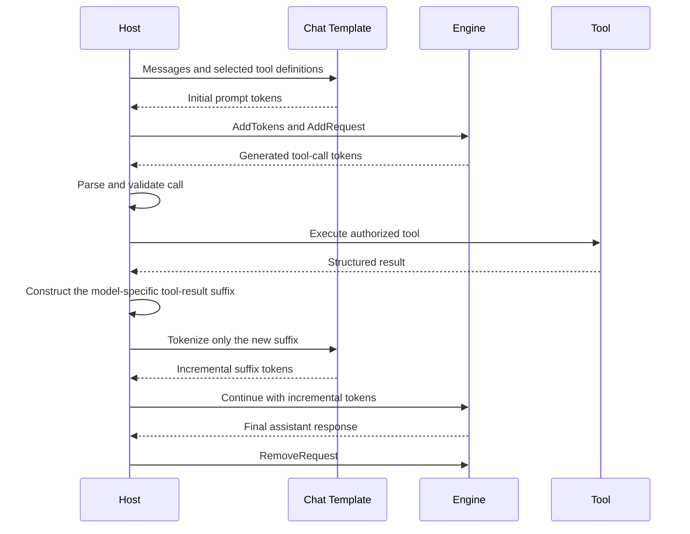

# Tool Calling with the ONNX Runtime GenAI Engine

## Design Summary

**Status:** Implemented on top of the Engine continuous-decoding lifecycle
**Scope:** End-to-end model-native tool calling with optional constrained decoding
**Primary scenario:** Render tools through a model chat template, generate a tool call, execute it in the host, continue the resident request with the tool result, and generate the final response

## Executive Summary

Tool calling is an application protocol layered over token generation. ONNX Runtime GenAI does not choose or execute tools. It provides the primitives the host needs to run the protocol efficiently:

- Model-owned chat-template rendering and tokenization.
- Engine scheduling, generation, and streaming.
- `Request::Continue()` and Python `request.continue_with()` for additional turns.
- Retained KV-cache state across turns when the selected provider supports continuous decoding.
- Optional per-request grammar-constrained decoding.

The Engine continuation lifecycle was added independently in PR #2423. This work consumes that lifecycle rather than defining another continuation mechanism. `AddTokens()` is initial-input-only. Once a turn reaches `TurnComplete`, the host appends the next chat-template suffix with `Continue()`.

The tool-calling additions in this change are:

- Request-local guidance integrated with Engine transaction rollback.
- Model-instance validation when requests enter an Engine.
- Weather and sandboxed coding-agent examples.
- End-to-end Engine tool-calling coverage.
- Incremental Qwen chat-template suffix construction for retained requests.

Native Qwen tool calling does not require guidance. Guidance is an optional structural-reliability layer.

## Ownership Boundary

The Engine owns token and model state. The host owns tool semantics and trust boundaries.

| Concern | Owner |
| --- | --- |
| Render messages and tools according to the model template | Chat-template/tokenizer layer |
| Schedule inference and retain model state | Engine |
| Constrain generated syntax | Optional guidance processor |
| Parse tool calls and validate arguments | Host application |
| Authorize and execute tools | Host application |
| Limit tool output and compact conversation history | Host application |
| Select which tools are visible on a turn | Host application |

No `Engine.execute_tool` or model-specific tool-call parser is introduced.

## End-to-End Flow



For Qwen, the chat template places function definitions in the prompt and renders calls between `<tool_call>` and `</tool_call>`. Stream decoding may omit special-token text, so examples also validate delimiter token IDs.

## Request Lifecycle

The merged Engine lifecycle is:

```text
Unassigned -- AddRequest --> Assigned -- schedule --> Active
                                  ^                    |
                                  |                    | turn stops
                                  +-- Continue() -- TurnComplete

Assigned / Active / TurnComplete -- Remove() --> Closed
```

The host uses the request as follows:

1. Call `AddTokens()` only for the initial prompt.
2. Add the request to the Engine.
3. Call `Step()` and drain all ready notifications and unseen output.
4. At `TurnComplete`, construct the model-specific chat-template fragment containing the tool result and next generation marker.
5. Tokenize only that new fragment.
6. Call `Continue()` with those incremental tokens.
7. Remove the request when no additional turn is needed.

Continuation input is not exposed as generated output. Generated output uses separate index bookkeeping, so unread output remains distinguishable from input added on later turns. The examples nevertheless drain each turn before parsing it because the complete output is required to execute the tool.

`max_length` is cumulative across the request: initial input, generated output, continuation input, and later generated output all consume the same context budget.

## Incremental Continuation Requirement

`Continue()` accepts only tokens that follow the request's existing sequence:

```text
request_tokens = initial_tokens + generated_tokens + continuation_tokens
```

The examples construct Qwen's next chat-template fragment directly: the current assistant turn terminator, a user-role `<tool_response>` block, and the next assistant generation marker. They tokenize only this fragment and pass the resulting IDs to `continue_with()`.

Do not rerender and retokenize the complete conversation to derive the suffix by removing the old token count. BPE and similar tokenizers can merge across the old/new text boundary, so a textual prefix is not guaranteed to remain a token-ID prefix. The Engine already retains the prior tokens and KV state; full-prompt prefix comparison is neither part of `Continue()` nor necessary when the host constructs the incremental fragment correctly.

Hosts that support multiple model families must use each model's continuation format. A reusable chat-template API for rendering only appended messages would avoid duplicating model-specific control tokens in application code.

## Cache Reuse and Long Tool Catalogs

### What continuation solves

Paged attention manages a request's KV blocks. Continuous decoding retains those blocks after `TurnComplete`, so the next turn processes only the newly appended suffix instead of prefilling the complete conversation again.

This improves time to first token after tool execution and avoids repeated compute for a live conversation. It does not remove tokens from the model's logical context.

### What continuation does not solve

A VS Code/Copilot-style payload containing 94 tools measured approximately:

- 188 KB of JSON request data.
- 29,306 rendered tokens with the tested Qwen tokenizer.
- 3,462 remaining positions in a 32,768-token model context before later tool results and output.

Retaining the 29,306-token KV prefix avoids recomputing it, but those tokens still occupy 29,306 context positions. Paged attention is therefore not equivalent to prompt compression or automatic cross-request prefix deduplication.

| Technique | Reduces repeated prefill | Frees logical context positions |
| --- | --- | --- |
| Same-request Engine continuation | Yes | No |
| Cross-request prefix caching | Yes | No |
| Shorter tool schemas | Yes | Yes |
| Tool routing/deferred tool loading | Yes | Yes |
| History and tool-result compaction | Yes | Yes |
| Request rollover with a compact prompt | After a new prefill | Yes |

### Recommended large-catalog strategy

The host should not expose every full schema on every turn. It should:

1. Maintain a compact catalog containing stable tool IDs, short descriptions, and groups.
2. Always include a small core set of broadly useful tools.
3. Select additional tools from user intent and application state.
4. Render only the selected full schemas, normally a small subset.
5. Bound tool results with excerpts, summaries, handles, or pagination.
6. Reserve generation and future-turn headroom before admitting a request.
7. Roll over to a new compacted request when the retained request approaches `max_length`.

Useful deterministic filters include whether a notebook or browser is active, whether Azure or GitHub intent is present, the current permission mode, file type, installed providers, and whether mutation is allowed.

A meta-tool such as `search_tools` or `load_tool_group` can expose deferred capabilities. Loading into an existing request is monotonic: appended definitions consume more context and cannot remove old definitions from retained KV state. To remove obsolete schemas, the host must create a new request from a compacted conversation.

### Cross-request prefix caching

Cross-request caching is separate future work. It would let independent requests reuse an identical system/tools prefix computationally, but it still would not increase the model context window. It also requires prefix matching, immutable or shared KV ownership, eviction, accounting, and privacy boundaries.

## Optional Engine Guidance

Each guided Engine request owns a constrained-logits processor because requests in one batch can use different grammars and occupy different grammar positions.

For every sampling transaction, the request:

1. Clones the grammar checkpoint.
2. Applies the current grammar mask to logits.
3. Samples and commits generated tokens to the grammar.
4. Discards the checkpoint when the Engine transaction commits.
5. Restores grammar, search, and RNG state when the transaction rolls back.
6. Resets the grammar at `TurnComplete` for a later generation turn.

The static and dynamic sampling paths both commit generated tokens. Guidance fast-forward tokens remain unsupported because injecting several grammar-selected tokens would require matching scheduler, output, and cache accounting.

The shared guidance implementation also fixes mask sizing for vocabulary lengths that are not divisible by 32 and keeps tokenizer callback state alive across cloned processors.

## Model Identity

An Engine rejects a request whose `GeneratorParams` belong to another model instance. Search configuration, vocabulary size, tokenizer assumptions, guidance state, and model execution must all refer to the same model. Admission-time validation prevents a later out-of-bounds mask or incompatible inference call.

## Examples

### Weather

`examples/python/engine/tool-calling.py` performs one complete tool round:

1. Render Qwen messages with `weather.json`.
2. Generate and validate `get_weather`.
3. Execute a deterministic local implementation.
4. Encode the incremental Qwen tool-result fragment.
5. Call `continue_with()` with only those new tokens.
6. Generate the final answer and remove the request.

### Coding agent

`examples/python/engine/coding-tool-calling.py` demonstrates a bounded host loop with sandboxed `read_file`, `edit_file`, and `run_tests` tools. It validates workspace containment, limits tool output, retries malformed calls, enforces a maximum number of rounds, and requires passing tests before accepting success.

### Long tool catalog

`examples/python/engine/long-context-tool-calling.py` accepts an OpenAI-style request envelope such as the captured VS Code payload. Its no-inference path:

- Loads every tool definition.
- Renders the complete prompt and reports exact token headroom.
- Synthesizes schema-shaped arguments for every tool.
- Validates and mock-executes all calls without side effects.

Its optional live path performs real model generation for selected tools or all tools, validates generated calls, supplies mock results, and measures first-turn versus continued-turn timings. An all-tools live sweep tests model behavior but is intentionally not the default because it repeatedly prefills a very large prompt and can take hours on CPU.

## Validation Strategy

### Runtime tests

- Reject guidance fast-forward and incomplete guidance configuration.
- Reject a request created for another model.
- Verify guidance masks invalid tokens.
- Verify transaction rollback restores grammar and search state.
- Rely on the Engine continuation suite for lifecycle, cache residency, unread output, static and dynamic continuation, backpressure, and rollback behavior.

### End-to-end tests

- Preserve existing Generator and C tool-calling coverage.
- Run the Engine weather conversation with the same model and schema.
- Run the coding sample manually against a tool-trained model.
- Use the long-context harness to distinguish schema/template admission from model tool-selection quality.

## Known Limitations

- Tool parsing, argument validation, authorization, and execution remain host responsibilities.
- Guidance fast-forward tokens are unsupported by Engine requests.
- The examples process one tool call at a time; a host may orchestrate multiple returned calls.
- A retained request cannot discard old tools or history; compaction requires request rollover.
- Same-request continuation does not provide cross-request prefix caching.
- Tool-trained model quality determines whether unconstrained generation emits valid calls.
- A guidance-enabled build requires the llguidance build dependencies.

## Follow-Up Work

1. Add guidance-enabled Engine CI coverage.
2. Benchmark guidance mask and grammar-clone overhead at Engine concurrency.
3. Measure tool-call accuracy and latency with routed subsets of 5, 10, and 20 tools versus the full 94-tool payload.
4. Add host examples for parallel tool calls and bounded result aggregation.
5. Define public capacity/headroom signals suitable for proactive request rollover.
6. Evaluate cross-request prefix caching separately from same-request continuation.

## Review Checklist

- Later turns use `Continue()` rather than `AddTokens()`.
- Continuation input contains only newly appended chat-template tokens.
- Full conversations are not retokenized to derive continuation suffixes.
- Requests are explicitly removed after the final turn.
- Guidance state participates in Engine commit and rollback.
- Tool execution remains outside the runtime.
- Large-catalog claims distinguish compute reuse from logical context usage.
- Generator and C tool-calling paths remain intact.