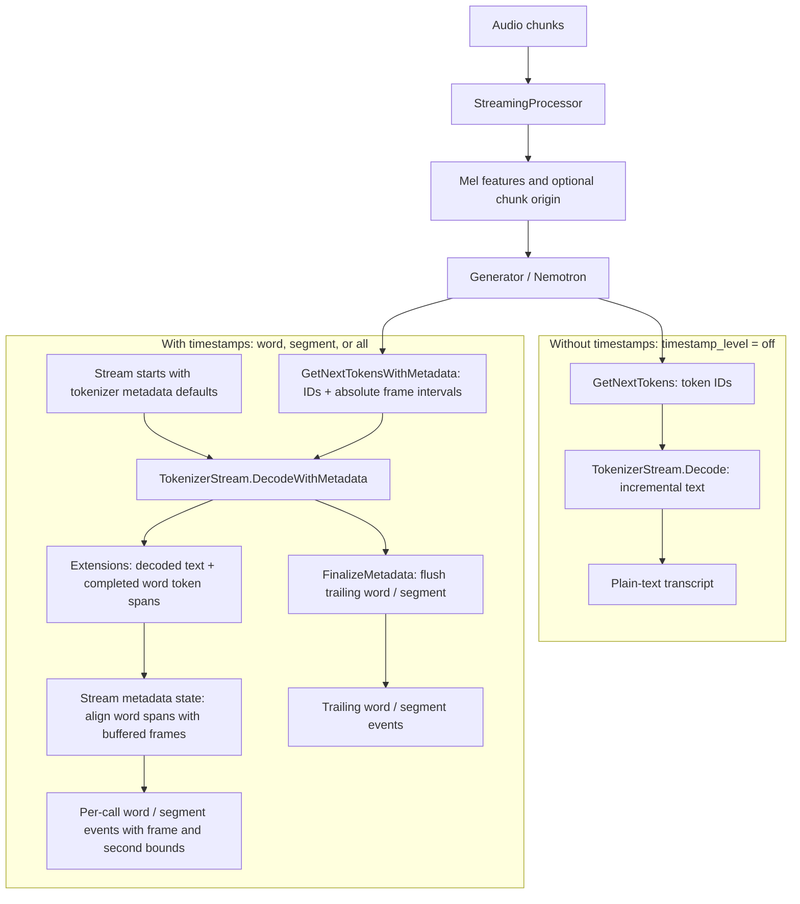

# Nemotron speech streaming timestamps

Nemotron streaming speech models can emit word and segment timestamps while preserving the same
incremental transcript fragments returned by ordinary tokenizer stream decoding.

## Model configuration

Add timestamp options under `model` in `genai_config.json`:

```json
{
  "model": {
    "timestamp_level": "all",
    "segment_separators": [".", "?", "!"],
    "segment_gap_threshold_seconds": 1.0
  }
}
```

`timestamp_level` controls timestamp generation:

| Value | Completed records |
| --- | --- |
| `off` | None (default) |
| `word` | Words |
| `segment` | Segments |
| `all` | Words and segments |

`segment_separators` is an optional array of decoded text suffixes that complete a segment. When
present, it replaces the default separators (`.`, `?`, and `!`). An empty array disables
separator-based completion.

`segment_gap_threshold_seconds` is an optional non-negative number measured in seconds. Zero splits
each word into its own segment; positive values shorter than half a frame round to the same behavior.
It is converted to the nearest encoder-frame count using half-up rounding. For a model with 80 ms frames, `1.0`
second becomes $1.0 / 0.08 = 12.5$, which rounds to 13 frames. Values below the half-frame boundary
round down. Set it to `null` or omit it to disable gap-based completion.

The frame duration comes from `sample_rate`, `hop_length`, and `subsampling_factor` under
`model` in the same `genai_config.json`; do not repeat them in metadata overrides.
If timestamps are requested for a non-Nemotron model, or these values are missing or non-positive,
model or tokenizer creation fails. Unknown timestamp levels and negative or non-finite gap
thresholds are rejected while loading the configuration.

## Decoding flows

Both paths start with audio processed into features, followed by generated token IDs. Model
configuration determines whether acoustic timing is produced; the first decode chooses each
stream's mode. A tokenizer stream cannot switch decode modes without `Reset()`.



For the timed path, create a tokenizer stream; its metadata state is initialized from
the tokenizer configuration. The generator supplies
*when* each token occurred; Extensions supplies *which tokens* form each word. `DecodeWithMetadata`
also returns the ordinary incremental text fragment. Use that fragment for live text, or collect
completed word/segment events for stable timestamped output; do not append both to one transcript.
The plain path needs no metadata state or finalization call.

Internally, the stream buffers the frame intervals in token order until Extensions reports
completed word spans and a pending-token watermark. It uses the first and last token
intervals of each word, accumulates unfinished segments across calls, and owns the
completed event text for the lifetime of the returned per-call result. The generator
pairs tokens and intervals by emission position, not by token ID.

## Decoding

For the timestamp path, create the tokenizer stream and use metadata decoding
directly. The stream initializes enabled model-derived metadata when created
and restores it after `Reset()`. Configure timestamp level and grouping rules on
the model before creating the tokenizer; the stream does not expose its internal
metadata state. Plain-text `Decode()` still works on a timestamp-configured
tokenizer when selected first. Disabled
timestamps produce null timestamp data.

For each generation step, use `GetNextTokensWithMetadata()` (C++/C#) or
`get_next_tokens_with_metadata()` (Python). Pass each whole record directly to
`DecodeWithMetadata(token)` or `decode_with_metadata(token)`; no field extraction
is needed. The optional acoustic interval is a pair of 64-bit integers ordered
`(start, stop)`, half-open and not restricted to one frame. With generator timestamps
disabled, timing is not read or supplied. C and C++ records indicate absence with
`has_token_acoustic_frame_interval == 0`; C# uses a null `TokenAcousticFrameInterval`
and Python uses `None`. The interval is stored inline, so copying a record retains
its timing independently of the generator's storage.
An enabled timestamp consumer requires present, valid timing.
Use a separate stream for each independent sequence.

The returned `text` is the ordinary incremental decoded fragment and remains available for partial
display. Applications that need only stable output can instead append completed word or segment
event text as it arrives.

Completed words retain their original leading whitespace and attached punctuation. Segment text is
the exact concatenation of its words; no whitespace is trimmed or synthesized. After finalization,
concatenating all emitted words or all emitted segments reproduces the decoded transcript exactly.
Copy native records before the next stream call. C# and Python bindings perform this copy
automatically.

Word and segment collections are nested under `timestampMetadata` in C/C++,
`TokenMetadataTimestamp` in C#, and `timestamp_metadata` in Python. They are per-call event lists,
not cumulative history. Each list is
empty when that call completes no records, and it may contain multiple records when one decoded
token spans multiple word or segment boundaries. Callers retain any history they need.

After the final audio chunk, call `FinalizeMetadata()` or `finalize_metadata()` once and retain
its completed records. Finalization returns pending words and segments but no additional transcript
text.

## Interval semantics

Frame and time intervals are half-open: `[start, stop)`. Each RNNT token initially covers one
encoder frame. Frame positions are absolute across all submitted audio, including chunks discarded
by VAD. Time values are seconds rounded to two decimal places.

Punctuation remains attached to its word. Segments complete on configured suffixes, configured
frame gaps, or finalization.

When `timestamp_level` is `off`, use ordinary `GetNextTokens()` and tokenizer stream `Decode()`.
The streaming processor does not create timestamp origin metadata, the transducer does not append
token intervals, and the tokenizer stream does not buffer intervals or build timestamp events.
