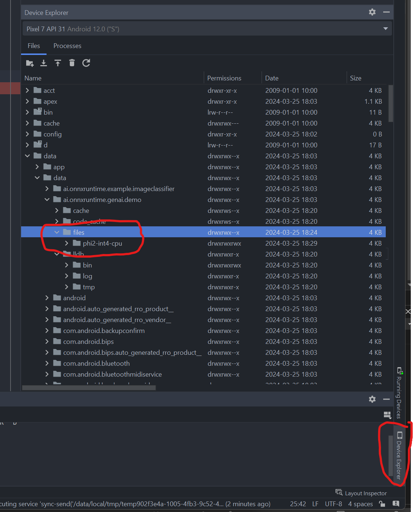

Follow these instructions to get phi-2: https://github.com/microsoft/onnxruntime-genai/blob/main/examples/csharp/README.md

The folder is too large to add to the app `assets` folder so we have to manually get it onto the device.

From Android Studio:
  - create (if necessary) and run your emulator
    - make sure it has at least 8GB of internal storage
  - debug/run the app so it's deployed to the device and creates it's `files` directory
    - expected to be `/data/data/ai.onnxruntime.genai.demo/files`
      - this is the path returned by `getFilesDir()` in MainActivity
    - not sure what triggers the creation of this directory. 
      - if you debug the app and set a breakpoint on the call to create the GenAIWrapper instance in MainActivity.onCreate it should exist when the breakpoint is hit
  - Open Device Explorer in Android Studio
  - Navigate to `/data/data/ai.onnxruntime.genai.demo/files`
    - adjust as needed if the value returned by getFilesDir() differs for your emulator
  - copy the whole phi-2 folder (should be called phi2-int4-cpu) to the `files` directory
  - it should look like this:
    - 

The rest _should_ work OOTB (in theory).
