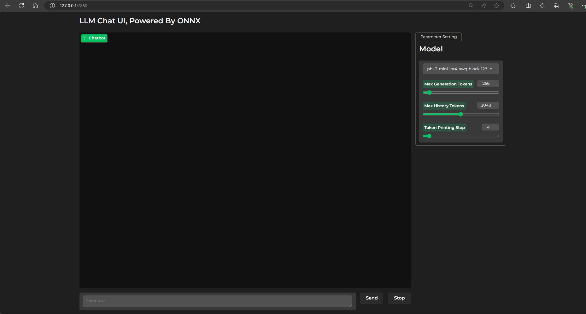
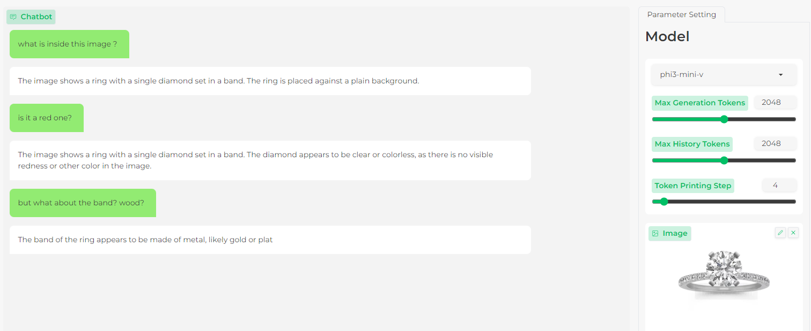

# LLM Chat UI <!-- omit in toc -->

This is a chat demo using the various versions of the LLMs

> The app supports all of the CPU, CUDA and DirectML. CUDA is used as an example.

**Contents**:
- [Setup](#setup)
- [Get the model](#get-the-model)
- [Launch the app](#launch-the-app)

## Setup

1. Install **onnxruntime-genai-cuda** 
    > If you want to use DirectML model, you can download `onnxruntime-genai-directml` package.
   
   ```
   pip install numpy
   pip install --pre onnxruntime-genai-cuda
   ```

2. Get this example

   ```bash
   git clone -n --depth=1 --filter=tree:0  https://github.com/microsoft/onnxruntime-genai.git
   cd onnxruntime-genai
   git sparse-checkout set --no-cone examples/chat_app
   git checkout
   cd examples/chat_app
   ```

3. Install the requirements

    ```bash
    pip install huggingface-hub mdtex2html
    pip install gradio==4.36.0 # Gradio 3.47 breaks the UI and versions between 3.42 and 3.47 haven't been tested
    ```


## Get the model

> If you already downloaded your model, you can skip this part and add `--model_path` when launching the app
> For example. `python chat_app/app.py -m "/mnt/onnx/Phi-3-vision"`

```bash
cd ..
huggingface-cli download microsoft/Phi-3-vision-128k-instruct-onnx-cuda --include cuda-int4-rtn-block-32/* --local-dir .
mkdir -p models/cuda
mv cuda-int4-rtn-block-32 models/cuda-int4/Phi-3-vision
```

If you would like the app to discover your models, please create the following folder structure, with the `models` folder at the same level as `chat_app`, one folder containing a set of models, and the actual models below this.

```
--chat_app
--models
   --directml
      --phi-3-vision-directml-int4-awq-block-128
      --meta-llama_Llama-2-7b-chat-hf
      --mistralai_Mistral-7B-Instruct-v0.1
            ...
   --cuda-int4
      --Phi-3-vision
```

If there is the word `vision` in the folder name containing the model files, the app will create a UI that processes images. If not, it will create a UI that processes language only.

## Launch the app

```
python app.py
```

You can also attach your model that is outside of `models` folder to the app by passing arguments of `--model_path` and `--model_name`.

```bash
python chat_app/app.py --model_name "Phi-3-vision" --model_path "/mnt/onnx/Phi-3-vision"
```

You should see output from console
```
Running on local URL:  http://127.0.0.1:7860

To create a public link, set `share=True` in `launch()`.
```

Then open the local URL in browser


For vision model, you will have the below UI interface.


