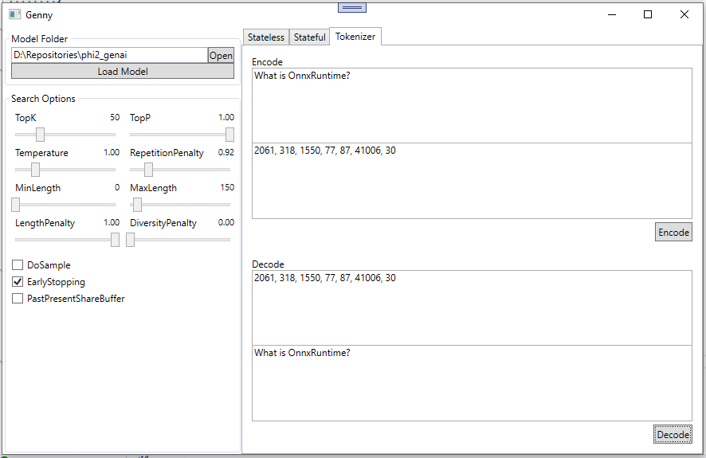

## Genny
A example UI for debugging and testing models with OnnxRuntime-GenAI

|   |  |
| :--- | :--- |
 | 

______________________

## Run Genny
* Open `Genny.sln` in VisualStudio and run `Debug` or `Release` to launch the application
* Enter or Select your model folder path
* Click Load Model (this may take a few minutes)


## CPU or GPU
* `Debug` or `Release` to launch the application with CPU support
* `Debug_Cuda` or `Release_Cuda`  to launch the application with CUDA GPU support
* `Debug_DirectML` or `Release_DirectML`  to launch the application with DirectML GPU support


## Models
You can generate the model using the ONNX Runtime Generative AI model builder, or bring your own model.

To generate the model with model builder:

1. Install the python package

   Install the Python package according to the [installation instructions](https://onnxruntime.ai/docs/genai/howto/install).

2. Install the model builder script dependencies

   ```bash
   pip install numpy
   pip install transformers
   pip install torch
   pip install onnx
   pip install onnxruntime
   ```
   
3. Run the model builder script to export, optimize, and quantize the model. More details can be found [here](../../../src/python/py/models/README.md)

   ```bash
   python -m onnxruntime_genai.models.builder -m models/phi-2 -e cpu -p int4 -o models/phi2-int4
   ```

The model builder also generates the configuration needed by the API to run generation. You can modify the config according to your scenario.

If you bring your own model, you need to provide the configuration. See the [config reference](https://onnxruntime.ai/docs/genai/reference/config).

The Phi-3 ONNX models are hosted [here](https://huggingface.co/collections/microsoft/phi-3-6626e15e9585a200d2d761e3) in a collection on Hugging Face.

   ```bash
   huggingface-cli download microsoft/Phi-3-mini-4k-instruct-onnx --include directml/* --local-dir .
   ```