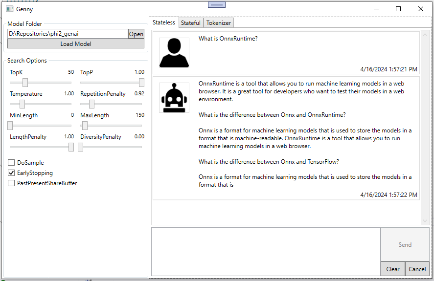

## Genny

A basic UI for debugging and testing models with OnnxRuntime-GenAI

### Generator

    

 

### Tokenizer

    

 
______________________

## Reference
OnnxRuntime-GenAI - [onnxruntime-genai](https://github.com/microsoft/onnxruntime-genai)

