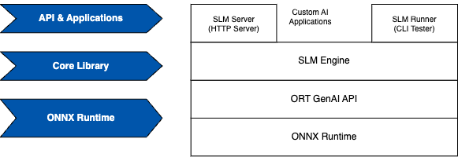

# SLM Engine for running GenAI on the Edge Compute

SLM Engine is a C++ based application that uses ONNX Runtime (ORT) genrate() API library and runs GenAI models on the edge computing resources. The SLM engine is developed to deploy generative AI models (sometimes fine-tuned for API function calling specific to certain Edge use cases). Any small language based generative AI model quantized to ONNX can run on SLM engine.

The following diagram illustrates a high level architecture of the SLM Engine and its relationship with the ONNX Runtime libraries.

<div align="center">
    
    <p>SLM Engine Architecture</p>
</div>

SLM Engine is designed to be built from sources for different types of target hardware to maximize the portability. Building from source allows maximum customization to ensure most efficient execution of workloads for specific target hardware.

The current version is tested on Windows 11, MacOS, Linux and Android running on the CPU of various platforms. The SLM Engine also runs on various accelerators (such as GPU and NPU) via the execution provider mechanism of the ONNX runtime.

## Installation

Since this is targeted for various devices running on the Edge we provide a simple to use build setup that the developers can use to build for any system of their choosing.

### Prerequisites

The SLM Engine first builds the `onnxruntime-genai` library from source. For some targets you also need to build `onnxruntime` from source. Therefore, any prerequisites that apply to build from source of these two libraries also applicable to SLM Engine. There are no additional requirements for building SLM engine.

In order to build the software you will need C++ toolchain such as clang/llvm and cmake. Since the build scripts use Python3, any Python 3 would work. However, to enable Qualcomm QNN support, you need to use a Linux host and Python 3.8. Note that Python module `requests` is required. Use `pip install requests` when setting up the Python for building this software.

<details>
 <summary><b>Windows Long File Path</b></summary>

For Windows, often the maximum path length is 260 which results in breaking the onnxruntime dependency build. Therefore, the long file path needs to be enabled in the group policy editor using the following steps:

- Open the 'Run' command (Win+R) and type gpedit.msc, then press Enter.
- Navigate to: Computer Configuration > Administrative Templates > System > Filesystem.
- Double-click Enable Win32 long paths and set it to Enabled, then click Apply.

Also, enable long filenames by opening a terminal window as **Administrator** and then running the following command:

```
c:\> git config --system core.longpaths true

```

</details>

#### Build

Building is as easy as following these steps:

#### 1. Build the Dependencies

```bash
$ cd build_scripts
$ python build_deps.py
...
```

All the dependency artifacts are stored in `slm_deps/artifacts/<PLATFORM>`. For example, if you are building on MacOS then the built artifacts will be stored in `slm_deps/artifacts/MacOS-armh64/`. Similarly, if you are cross compiling for Android, then the artifacts will be stored in `slm_deps/artifacts/Android-aarch64/`.

<details>

 <summary><b>Dependency Build Details</b></summary>
 <p>

Depending on the build options specified, the `onnxruntime` is either built from pre-built binaries or source. The pre-built option is not available for Android or MacOS Sequoia. Next, `onnxruntime-genai` library is built from source. Finally, the script will clone and build few other `header only` dependencies.

At the end of the build, all the built artifacts such as the header files and libraries are stored inside the deps/artifacts directory under a subdirectory that's named after the target platform.

#### build_deps.py

Following are the command line options applicable for the dependency build:

```bash
usage: build_deps.py [-h] [--android_sdk_path ANDROID_SDK_PATH] [--android_ndk_path ANDROID_NDK_PATH]
                     [--api_level API_LEVEL] [--qnn_sdk_path QNN_SDK_PATH] [--build_type BUILD_TYPE] [--build_ort_from_source] [--ort_version_to_use ORT_VERSION_TO_USE]

Build script for dependency libraries

options:
  -h, --help            show this help message and exit
  --android_sdk_path ANDROID_SDK_PATH
                        Path to ANDROID SDK
  --android_ndk_path ANDROID_NDK_PATH
                        Path to ANDROID NDK
  --api_level API_LEVEL
                        Android API Level
  --qnn_sdk_path QNN_SDK_PATH
                        Path to Qualcomm QNN SDK (AI Engine Direct)
  --build_type BUILD_TYPE
                        {Release|RelWithDebInfo|Debug}
  --build_ort_from_source
                        If set, ONNX Runtime is built from source

  --ort_version_to_use ORT_VERSION_TO_USE
                        ONNX Runtime version to use. Must be a git tag or branch

```

#### Notes

1. Use the option `--ort_version_to_use` and provide a git commit hash or a branch name or a tag, if you want to use a specific version of the ONNX Runtime library. However, if you previously used a different ONNX Runtime version, then delete the `deps/src/onnxruntime` directory before running the `build_deps.py` again with this option provided.

1. For Android builds, the `--build_ort_from_source` option must be set as for Android build, only build from source is supported.

#### Android Build With QNN Support

The following example illustrates how to cross compile the dependencies for Android CPU from Linux host.

```bash
$ export ANDROID_SDK_ROOT=<Android SDK Directory>
$ export NDK_ROOT=$ANDROID_SDK_ROOT/ndk/<Version Number>
$ export QNN_SDK_ROOT=<qualcomm/qairt/VERSION>
$ python build_deps.py \
    --android_sdk_path $ANDROID_SDK_ROOT \
    --android_ndk_path $NDK_ROOT \
    --build_ort_from_source \
    --qnn_sdk_path $QNN_SDK_ROOT
...

```

If you are building just for Android CPU, then omit the `qnn_sdk_path`.

After the dependencies are built, it's time to build the SLM Engine as described in the next section.

</details>

#### 2. Build SLM Engine

Next step is to build the program itself. For that use the script `build.py` with appropriate command line options as needed for Android build.

```bash
$ python build.py
```

<details>

 <summary><b>Build Details</b></summary>
 <p>

For Android build, the following commandline options are important:

```bash
usage: build.py [-h] [--android_ndk_path ANDROID_NDK_PATH] [--build_type BUILD_TYPE]

Build script for this repo

options:
  -h, --help            show this help message and exit
  --android_ndk_path ANDROID_NDK_PATH
                        Path to ANDROID NDK
  --build_type BUILD_TYPE
                        {Release|RelWithDebInfo|Debug}

```

For Android builds - use the following example:

```bash
$ python build.py --android_ndk_path $NDK_ROOT
...
```

Notice that no need to specify any QNN flags as QNN device is handled by the ONNX Runtime via the [Execution Provider](https://onnxruntime.ai/docs/execution-providers/) mechanism.

For building on a Linux host we also provide a Dockerfile and a shell script to build using docker. Use the following command:

```bash
$ ./build_linux.sh
...
```

</details>

### Target Specific onnxruntime Library Build Information

Following table provides target specific build information for the `onnxruntime` library.

| Build Host       | Target Platform  | Using prebuilt <br>onnxruntime | Output <br>Directory | Relevant <br>Build Options                                           |
| ---------------- | ---------------- | ------------------------------ | -------------------- | -------------------------------------------------------------------- |
| MacOS/arm64      | Android-aarch64  | ❌                             | Android-aarch64      | --android_sdk_path <br>--android_ndk_path<br>--build_ort_from_source |
| MacOS/arm64      | MacOS-arm64      | ❌                             | Darwin-arm64         | --build_ort_from_source                                              |
| Ubuntu 24.04/x86 | Android-aarch64  | ❌                             | Android-aarch64      | --android_sdk_path <br>--android_ndk_path<br>--build_ort_from_source |
| Ubuntu 24.04/x86 | Ubuntu 24.04/x86 | ✅                             | Linux-x86_64         | --build_ort_from_source (optional)                                   |
| Ubuntu 24.04/ARM | Ubuntu 24.04/ARM | ✅                             | Linux-aarch64        | --build_ort_from_source (optional)                                   |
| Windows 11/AMD64 | Windows 11 AMD64 | ✅                             | Windows-AMD64        | --build_ort_from_source (optional)                                   |
| Windows 11/ARM64 | Windows 11 ARM64 | ✅                             | Windows-ARM64        | --build_ort_from_source (optional)                                   |

## Using SLM Engine

To use the SLM Engine in your AI application, use one of the following methods:

- Use the C++ library from your C++ application by including the `slm_engine.h` and creating an instance of the `SLMEngine` class.

OR

- Run the command line program `slm-server` which starts a web server and exposes an API endpoint that accepts OpenAI like chat completion API. Then make REST API calls pointing at this endpoint from your application.

### SLM Server

The command line options of the slm-server are the following:

```shell
$ ./slm-server  --help
SLM Runner Version: 1.0.0
ORT GenAI Version: 0.7.0-dev
ORT Version: 1.20.1
Usage: slm_server --model_path VAR [--port_number VAR] [--verbose]

Optional arguments:
  -m, --model_path     Path to the model file [required]
  -p, --port_number    HTTP Port Number to use (default 8080)
  -v, --verbose        If provided, more debugging information printed on standard output
```

### Example Launch Command

```shell
$ ./slm-server -m <path to the ONNX model> -v

```

Once the server is running, you can use a HTTP client to send user queries to the server and generate responses. Following is an example cURL command that talks to the SLM Engine vis the REST API:

### Example cURL

```bash
curl -X POST http://localhost:8000/completions -H "Content-Type: application/json" --data '{"messages": [{"role": "system", "content": "You are a helpful AI Assistant. Please answer the questions very accurately. Use emojis and markdown as appropriate"},{"role": "user", "content": "What are the top 5 places to visit in San Diego? Be brief."}], "max_tokens": 1200, "temperature": 0.7}'
```

The SLM server supports the following REST APIs (click to expand):

<details>
 <summary><code>GET</code> <code><b>/</b></code> <code>Returns SLM server status</code></summary>

##### Parameters

> None

##### Responses

> | http code | content-type       | response      |
> | --------- | ------------------ | ------------- |
> | `200`     | `application/json` | `JSON Object` |

##### Example cURL

```javascript
>  curl -X GET http://localhost:8000
```

##### JSON Schema for the Response for GET /

```json
{
    "response":
    {
        "status": "success",
        "engine_state":
        {
            "engine_version": <Version String>,
            "model": <Model name>
        }
    }
}
```

</details>

<details>
 <summary><code>POST</code> <code><b>/complete</b></code> <code>Given the prompt, generates response from SLM</code></summary>

##### Parameters

> | name | type     | data type                                   | description |
> | ---- | -------- | ------------------------------------------- | ----------- |
> | None | required | object (JSON formatted using OpenAI schema) | N/A         |

##### Responses

> | http code | content-type       | response      |
> | --------- | ------------------ | ------------- |
> | `200`     | `application/json` | `JSON Object` |

##### JSON Schema for the Response for /completions (success)

```json
{
    "response":
    {
        "status": "success",
        "choices": [
            "index": 0,
            "message": {
                "role": "assistant",
                "content": "<LLM Generated content>"
            },
        ]
        "kpi": {
            "generated_toks": <Value>,
            "prompt_toks": <Value>,
            "tok_rate": <value>,
            "total_time": <Value>,
            "ttft": <Value>
        },
        "question": <User's Question>,
        "llm_input": "<Actual String input to LLM"
    }
}
```

##### JSON Schema for the Response for /completions (error)

```json
{
  "response": {
    "status": "error",
    "message": "Error Message"
  }
}
```

</details>

### C++ Application using the SLMEngine

The SLMEngine is designed to be used from another C++ application running on the Edge. Integrating the SLMEngine into another C++ project using cmake is illustrated below.

First build the SLM Engine from source using the build instructions provided in this document. The build output are stored in the target specific `install/include` and `install/bin` directories.

#### CMakeLists.txt

```cmake
cmake_minimum_required(VERSION 3.28)
project(HelloSLM)

set(CMAKE_CXX_STANDARD 17)
set(CMAKE_CXX_STANDARD_REQUIRED ON)
set(CMAKE_CXX_EXTENSIONS OFF)

add_library(slm_engine SHARED IMPORTED)
set_target_properties(
    slm_engine
    PROPERTIES
    IMPORTED_IMPLIB
    <location-of-slm-artifacts>/bin/libslmengine.so
)
add_library(ort SHARED IMPORTED)
set_target_properties(
    ort
    PROPERTIES
    IMPORTED_IMPLIB
    <location-of-slm-artifacts>/bin/libonnxruntime.so

add_library(ort_genai SHARED IMPORTED)
set_target_properties(
    ort_genai
    PROPERTIES
    IMPORTED_IMPLIB
    <location-of-slm-artifacts>/bin/libonnxruntime-genai.so

include_directories(<location-of-slm-artifacts>/include)

add_executable(hello_slm hello_slm.cpp)
target_link_libraries(inference_server slm_engine ort ort_genai)

```

#### hello_slm.cpp

```c++

#include <string>
#include <iostream>
#include "slm_engine.h"

int main(int argc, char **argv) {

    auto slm_engine = microsoft::slm_engine::SLMEngine::CreateEngine(
        "path to ONNX Model Directory", "phi", true);

    if (!slm_engine) {
        std::cout << "Cannot create engine!\n";
        return;
    }

    microsoft::slm_engine::SLMEngine::GenerationOptions generator_options;
    generator_options.MaxGeneratedTokens = 2400;
    std::string response_str;
    microsoft::slm_engine::SLMEngine::RuntimePerf kpi;

    // Call the SLM engine
    slm_engine->generate("What is 2 + 2?", generator_options, response_str, kpi);

    std::cout << "Generated Response: " << response_str << std::endl;
}

```

See the [slm_engine.h](src/cpp/slm_engine.h) for more details of the C++ API.

See the following reference CLI applications to learn more about how to use an HTTP server [slm_server.cpp](src/cpp/slm_server.cpp) or a CLI program for batch generation processing [slm_runner.cpp](src/cpp/slm_runner.cpp) using this library.

## Running SLM Engine

After the build is complete, the binaries are available in the build_scripts/builds/<TARGET_NAME>/install/bin directory. To test the build, download the ONNX model first and then run following command to execute SLM engine with a sample input file.

### Download ONNX Model

1. Navigate to the Hugging Face and download an SLM such as [Microsoft Phi-3-mini-4k-instruct](https://huggingface.co/microsoft/Phi-3-mini-4k-instruct-onnx)
1. Next run the `slm-runner` CLI program pointing at the CPU version of the quantized model.

Following example show how to test this on a Windows 11:

```Powershell
>  cd .\build_scripts\builds\Windows-ARM64\install\bin\
>  .\slm-runner.exe -mf phi -t ..\..\..\..\..\test\batch-input.jsonl -m ..\..\..\..\..\..\..\..\..\models\Phi-3-mini-4k-instruct-onnx\cpu_and_mobile\cpu-int4-rtn-block-32-acc-level-4\ -o output.jsonl -v

```

The SLM Runner used above is a CLI program for testing the SLM engine in a batch mode. The following section provides more details.

#### SLM Runner

The `slm-runner` CLI application works in a batch mode and thus useful for benchmarking and testing. In addition to the ONNX model, you will also need to prepare a JSONL file that contains the system and user prompts formatted like OpenAI API. Following is an example of a line of JSON fragment that contains the `system` and `user` messages:

```shell
$ ./slm-runner --help
SLM Runner Version: 1.0.0
ORT GenAI Version: 0.7.0-dev
ORT Version: 1.20.1
Unknown argument: --help
Usage: slm_runner --model_path VAR --test_data_file VAR --output_file VAR [--verbose]

Optional arguments:
  -m, --model_path             Path to the model file [required]
  -t, --test_data_file         Path to the test data file (JSONL) [required]
  -o, --output_file            Path to the output file (JSONL) [required]
  -w, --wait_between_requests  Wait time between requests in milliseconds
  -v, --verbose                If provided, more debugging information printed on standard output
```

```JSON
{"messages":
    [
        {
            "role": "system",
            "content": "You are an in car virtual assistant that maps user's inputs to the corresponding function call in the vehicle. You must respond with only a JSON object matching the following schema: {\"function_name\": <name of the function>, \"arguments\": <arguments of the function>}"
        },
        {
            "role": "user", "content": "Can you please set the radio to 90.3"
        }
    ],
    "max_tokens": 300,
    "temperature": 0.0,
    "stop": ["\n"]
}

```
